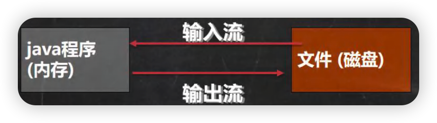
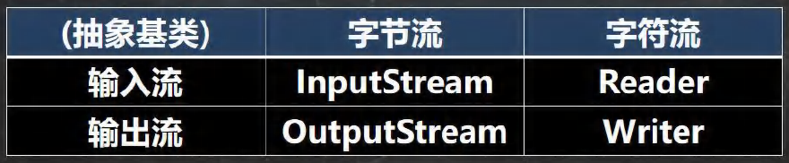
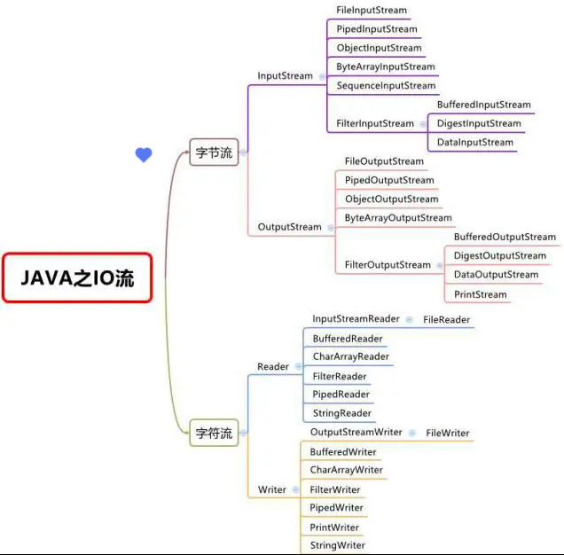
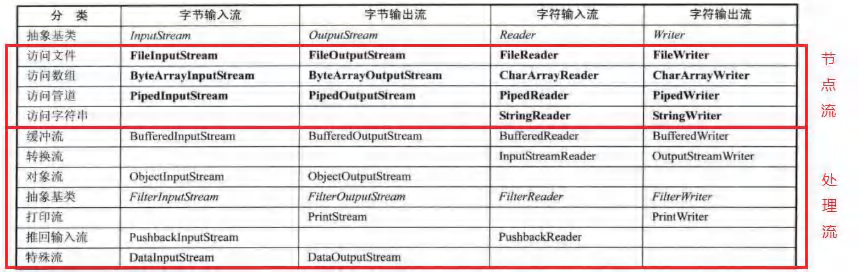

# 一、文件     chapter19文件夹

## 1、什么是文件

文件，对我们并不陌生，文件时**保存数据的地方**，比如大家经常使用的word文档，txt文件，execl文件...都是文件。它既可以保存一张图片，也可以保存视频，声音...

## 2、文件流

文件在程序中是以流的形式来操作的

流：数据在数据源(文件)和程序(内存)之间经历的路径

输入流：数据从数据源(文件)到程序(内存)的路径

输出流：数据从程序(内存)到数据源(文件)的路径

# 二、常用的文件操作

## 1、创建文件对象相关构造器和方法

- 相关方法

  new File(String pathname)//根据路径构建一个File对象

  new File(File parent,String child) //根据父目录文件+子路径构建

  new File(String parent,String child)//根据父目录+子路径构建

- createNewFile 创建新文件

## 2、获取文件的相关信息

- getName() 文件名字

- getAbsolutePath() 文件绝对路径

- file.getParent() 文件父级目录

- file.length() 文件大小(字节)

- file.exists() 文件是否存在

- file.isFile() 是不是一个文件

- file.isDirectory() 是不是一个目录

## 3、目录的操作和文件删除

- mkdir() 创建一级目录
- mkdirs() 创建多级目录
- delete() 删除空目录或文件

# 三、IO流原理及流的分类

## 1、Java IO流原理

- I/O是Input/Output的缩写，I/O技术是非常使用的技术，用于处理数据传输。如读/写文件，网络通讯等
- Java程序中，对于数据的输入/输出操作以“流(stream)”的方式进行
- java.io包下提供了各种“流”类和接口，用以获取不同种类的数据，并通过方式输入或输出数据
- 输入input：读取外部数据(磁盘、光盘等存储设备的数据)到程序(内存)中
- 输出output：将程序(内存)数据输出到磁盘、光盘等存储设备中

## 2、流的分类

- 按操作数据单位不同分为：
  - 字节流(8 bit) 二进制文件
  - 字符流(按字符) 文本文件
- 按数据流的流向不同分为：
  - 输入流
  - 输出流
- 按流的角色的不同分为：
  - 节点流
  - 处理流/包装流
- 
  - Java的IO流共涉及40多个类，实际上非常规则，都是从如上4个抽象基类派生的
  - 由这四个类派生出来的子类名称都是以其父类名作为子类名后缀

# 四、IO流体系图

## 1、InputStream：字节输入流

- InputStream抽象类是所有类字节输入流的超类
- InputStream常用的子类
  1. FileInputStream：文件输入流
  2. BufferedInputStream：缓冲字节输入流
  3. ObjectInputStream：对象字节输入流

## 2、FileOutputStream

- 创建方式
- new FileOutputStream(filePath) //当写入内容时，会覆盖原来的内容
- new FileOutputStream(filePath, true) //当写入内容时，是追加到原来的内容后面
- 写入方式
  - write(byte[] b); //单字节写入
  - write(byte[] b, int off, int len) //将 len字节从位于偏移量off 的指定字节数组写入此文件输出流

## 3、FileReader和FileWriter介绍

FileReader和FileWriter是字符流，即按照字符来操作io

### 1、FileReader相关方法

1. new FileReader(File/String)
2. read：每次读取单个字符，返回该字符，如果到文件末尾返回-1
3. read(char[])：批量读取多个字符到数组，返回读取到的字符数，如果到文件末尾返回-1

相关API

1. new String(char[])：将char[]转换成String
2. new String(char[],off,len)：将char[]的指定部分转换成String

### 2、FileWriter常用方法

1. new FileWriter(File/String)：覆盖模式，相当于流的指针在首端
2. new FileWriter(File/String,true)：追加模式，相当于流的指针在尾端
3. writer(int)：写入单个字符
4. writer(char[])：写入指定字符
5. writer(char[],off,len)：写入指定数组的指定部分
6. writer(String)：写入整个字符串
7. writer(String,off,len)：写入字符串的指定部分

相关API：String类：toCharArray：将String转换成char[]

**注意**

FileWriter使用后，必须要关闭(close)或刷新(flush)，否则写入不到指定的文件

# 五、节点流和处理流

## 1、基本介绍

1. 节点流可以从一个特定的数据源读写数据，如FileReader、FileWriter
2. 处理流(也叫包装流)是“连接”在已存在的流(节点流或处理流)之上，为程序提供更为强大的读写功能，也更加灵活，如BufferedReader、BufferedWriter

## 2、节点流和处理流一览图

## 3、节点流和处理流的区别和联系

1. 节点流是底层流/低级流，直接跟数据源相接
2. 处理流(包装流)包装节点流，既可以消除不同节点流的实现差异，也可以提供更方便的方法来完成输入输出
3. 处理流(也叫包装流)对节点流进行包装，使用了修饰器设计模式，不会直接与数据源相连

## 4、处理流的功能主要体现在以下两个方面

1. 性能的提高：主要以增加缓冲的方式来提高输入输出的效率
2. 操作的便捷：处理流可能提供了一系列便捷的方法来一次输入输出大批量的数据，使用更加灵活方便

## 5、处理流-BufferedReader和BufferedWriter

1. BUfferedReader和BufferedWriter属于字符流，是按照字符来读取数据得
2. 关闭处理流时，只需要管外层流即可

## 6、处理流-BufferedInputStream和BufferedOutputStream

1. BufferedInputStream 是字节流，在创建 BufferedInputStream时，会创建一个内部缓冲区数组
2. BufferedOutputStream 是字节流，实现缓冲的输出流，可以将多个字节写入底层输出流中，而不必对每次字节写入调用底层系统

## 7、对象流-ObjectInputStream和ObjectOutputStream

- **序列化和反序列化**
  1. 序列化就是在保存数据时，保存数据的值和数据类型
  2. 反序列化就是在恢复数据时，恢复数据的值和数据类型
  3. 需要让某个对象支持序列化机制，则必须让其类时可序列化的，为了让某个类是可序列化的，该类必须实现如下两个接口之一：
     - Serializable：这是一个标记接口
     - Externalizable：该接口有方法需要实现，因此我们一般实现上面的Serializable接口
- 基本介绍
  1. 功能：提供了对基本类型或对象类型的序列化和反序列化的方法
  2. ObjectOutputStream 提供 序列化功能
  3. ObjectInputStream 提供 反序列化功能
- **注意事项和细节说明**
  1. 读写顺序要一致
  2. 要求实现序列化或反序列化对象，需要实现 Serializable
  3. 序列化的类中建议添加SerialVersionUID,为了提高版本的兼容性
  4. 序列化对象时，默认将里面所有属性都进行序列化，但除了static或transient修饰的成员
  5. 序列化对象时，要求里面属性的类型也需要实现序列化接口
  6. 序列化具备可继承性，也就是如果某类已经实现了序列化，则它的所有子类也已经默认实现了序列化

## 8、标准输入输出流

| 名称                   | 类型        | 默认设备 |
| ---------------------- | ----------- | -------- |
| System.in  标准输入流  | InputStream | 键盘     |
| System.out  标准输出流 | PrintStream | 显示器   |

## 9、转换流-InputStreamReader和OutputStreamReader

1. InputStreamReader：Reader的子类，可以将InputStream(字节流)包装成(转换)Reader(字符流)
2. OutputStreamWriter：Writer的子类，实现将OutputStream(字节流)包装成(转换)Writer(字符流)
3. 当处理纯文本数据时，如果使用字符流效率更高，并且可以有效解决中文问题，所以建议将字节流转换成字符流
4. 可以在使用时指定编码格式(比如 utf-8，gbk，gb2312，ISO8859-1等)

## 10、打印流-PrintStream和PrintWriter

打印流只有输出流，没有输入流

# 六、Properties类

## 1、基本介绍

1. 专门用于读写配置文件的集合类

   ~~~properties
   配置文件的格式
   键=值
   键=值
   ~~~

2. 注意：键值对不需要有空格，值不需要用引号引起来，默认类型是String

3. Protperties的常见方法

   - load()：加载配置文件的键值对到Properties对象
   - list()：将数据显示到指定设备
   - getProperties(key)：根据键获取值
   - setProperties(key,value)：设置键值对到Properties对象
   - store(arg0,arg1)：将Properties中的键值对存储到配置文件，在idea中，保存信息到配置文件，如果含有中文，会存储为unicode码
     - 第一个参数为 OutputStream/Writer 用来指向加载的配置文件
     - 第二个参数为 String 用来给配置文件添加注释
   - http://tool.chinaz.com/tools/unicode.aspx unicode码查询工具