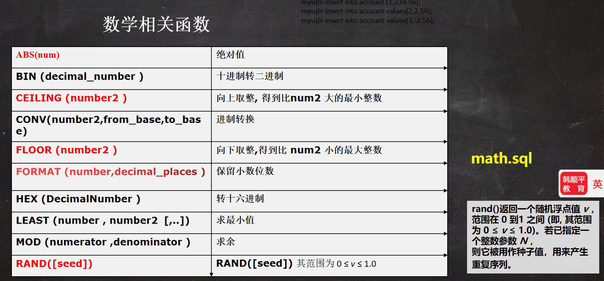

# 一、MySQL安装

Win mysql安装：[Windows下安装MySQL详细教程 - m1racle - 博客园 (cnblogs.com)](https://www.cnblogs.com/zhangkanghui/p/9613844.html)

初始化data命令

mysqld --initialize -insecure --user=mysql

# 二、数据库三层结构

1. 所谓安装MySQL数据库，就是在主机安装一个数据库管理系统(DBMS)，这个管理程序可以管理多个数据库。DBMS(database)
2. 一个数据库中可以创建多个表，以保存数据(信息)
3. 数据库管理系统(DBMS)、数据库和表的关系如图所示：示意图


# 三、SQL语句分类

- DDL：数据定义语句[create 表，库。。]
- DML：数据操作语句[增加 insert、修改 update、删除 delete]
- DQL：数据查询语句[select]
- DCL：数据控制语句[管理数据库：比如用户权限 grant revoke]

# 四、库操作

## 1、数据库连接

```bash
mysql -h 主机名 -P 端口 -u 用户名 -p 密码

mysql -h 127.0.0.1 -P 3306 -u root -p root
```

1. -p密码不要有空格
2. -p后面没有写密码，回车会要求输入密码
3. 如果没有写-h 主机，默认就是本机
4. 如果没有写-P 端口，默认就是3306
5. 在实际工作中，3306一般修改

## 2、创建数据库

```sql
CREATE DATABASE [IF NOT EXISTS] 数据库名 CHARACTER SET 数据库采用的字符集 COLLATE 字符集的校对规则
```

- CHARACTER SET:指定数据库采用的字符集，如果不指定字符集，默认utf8

- COLLATE:指定数据库字符集的校对规则
  - utf8_bin 区分大小写
  - utf8_general_ci 不区分大小写
  - 默认是utf8_general_ci

## 3、查看数据库

```sql
SHOW DATABASES
```

## 4、删除数据库

```sql
DROP DATABASE [IF EXISTS ] 数据库名
```

## 5、查看数据库的定义信息

```sql
SHOW CREATE DATABASE `数据库名`

注：创建数据库、表的时候，为了规避关键字，可以使用反引号解决
```

## 6、备份数据库

```sql
#备份数据库
mysqldump -u 用户名 -p -B 数据库1 数据库2 数据库n > 路径/文件名.sql

#备份数据库中表
mysqldump -u 用户名 -p  数据库 表1 表2 表n > 路径/文件名.sql

注：该指令要在DOS下执行
```

## 7、恢复数据库

```sql
Source 路径/文件名.sql

注：该指令要进入mysql下执行
```

# 五、数据类型


## 1、数值型(整数)

| 类型                | 字节 | 最小值               | 最大值               |
| :------------------ | :--- | :------------------- | :------------------- |
| TINYINT             | 1    | -128                 | 127                  |
| TINYINT(unsigned)   | 1    | 0                    | 255                  |
| SMALLINT            | 2    | -32768               | 32767                |
| SMALLINT(unsigned)  | 2    | 0                    | 65535                |
| MEDIUMINT           | 3    | -8388508             | 8388607              |
| MEDIUMINT(unsigned) | 3    | 0                    | 16777215             |
| INT                 | 4    | -2147483648          | 2147483647           |
| INT(unsigned)       | 4    | 0                    | 16777215             |
| BIGINT              | 8    | -9223372036854775808 | 9223372036854775807  |
| BIGINT(unsigned)    | 8    | 0                    | 18446744073709551615 |

```sql
CREATE TABLE t1 (id TINYINT);#默认是有符号的，-128~127
CREATE TABLE t2 (id TINYINT UNSIGNED);#指定unsigned,就是无符号0~255
```

## 2、数值型(bit)


## 3、数值型(小数)


## 4、字符串(char&varchar)

- CHAR(size)
  - 固定长度字符串最大255 字符
- VARCHAR(size) 0~65535 字节
  - 可变长度字符串最大65532 字节【本身还需要1-3个字节用于记录存放内容长度】
  - 如果表的编码是utf8 ，size = (65535-3) / 3 = 21844
  - 如果表的编码是gbk ， size = (65535-3) / 2 = 32766
- 查询速度 CHAR > VARCHAR，因此数据是定长时，推荐使用CHAR

如果 VARCHAR 不够用，可以使用mediumtext、text、longtext

- 字符串使用细节

  1. char(4) //这个4表示字符数(255)，不是字节数，不管是中文还是字母都是放4个，按字符计算

     varchar(4) //这个4表示字符数，不管是字母还是中文都以定义好的表的编码来存放

     不管是中文还是英文字母，都是最多存放4个，是按照字符来存放的

  2. char(4) 是定长(固定的大小)，就是说，即使你插入'aa'，也会占用分配的4个字符的空间

     varchar(4) 是变长(**变化的大小**)，就是说，如果你插入了 'aa'，实际占用空间大小并不是4个字符，而是按照实际占用空间来分配

  3. 什么时候使用char，什么时候使用varchar

     1. 如果数据是定长，推荐使用char，比如md5的密码，邮编，手机号，身份证号码等，char(32)
     2. 如果一个字段的长度是不确定，我们使用varchar，比如留言，文章

     查询速度：char > varchar

  4. 在存放文本时，也可以使用Text 数据类型，可以将text列视为varchar列，注意text不能有默认值，大小0-2^16字节，如果希望存放更多字符，可以选择mediumtext 0-2^24 或者 longtext 0-2^32

## 5、日期类型

```sql
CREATE TABLE b_name (
  birthday DATE , -- 生日
  job_time DATETIME, -- 记录年月日时分秒
  login_time TIMESTAMP
  NOT NULL DEFAULT CURRENT_TIMESTAMP
  ON UPDATE CURRENT_TIMESTAMP); -- 登录时间, 如果希望login_time列自动更新, 需要配置

SELECT * FROM b_name;
INSERT INTO b_name(birthday, job_time)
VALUES('2022-11-11','2022-11-11 10:10:10');
-- 如果我们更新b_name表的某条记录，login_time列会自动的以当前时间进行更新
```

# 六、表操作

## 1、创建表

```sql
CREATE TABLE 表名(
    field1 datatype NOT NULL AUTO_INCREMENT，PRIMARY KEY,
    field2 datatype DEFAULT 'test',
    field3 datatype,
)character set 字符集 collate 校对规则 engine 存储引擎

注：
field:指定列名，datatype: 指定列类型(字段类型)
character set :如不指定则为所在数据库字符集
collate:如不指定则为所在数据库校对规则
engine:引擎(这个涉及内容较多，后面单独讲解)
```

- 如果你不想字段为 **NULL** 可以设置字段的属性为 **NOT NULL**， 在操作数据库时如果输入该字段的数据为**NULL** ，就会报错。
- **AUTO_INCREMENT**定义列为自增的属性，一般用于主键，数值会自动加1。
- **PRIMARY KEY**关键字用于定义列为主键。 您可以使用多列来定义主键，列间以逗号分隔。
- **DEFAULT**关键字用于定义列的默认值

```sql
CREATE TABLE `user`(
  id INT,
  name VARCHAR (255),
  password VARCHAR (255),
  birthday DATE
)CHARACTER SET utf8 COLLATE utf8_bin ENGINE INNODB ;
```

## 2、查看表结构

```sql
DESC 表名  -- 显示表结构，可以查看表的所有列
```

## 3、删除表

```sql
DROP TABLE [IF EXISTS] 表名
```

## 4、添加列

```sql
ALTER TABLE 表名
ADD 列名 数据类型 [DEFAULT expr]

-- 在员工表emp中增加一个image列，varchar类型(要求在resume后面)，默认不为空，默认数据为test。
ALTER TABLE emp
ADD image VARCHAR(32) NOT NULL DEFAULT 'test'
AFTER RESUME

DESC emp -- 显示表结构，可以查看表的所有列
```

## 5、修改列

```sql
ALTER TABLE 表名
MODIFY 列名 数据类型 [DEFAULT expr]

-- 修改job列，使其长度为60。
ALTER TABLE emp
MODIFY job VARCHAR(60) NOT NULL DEFAULT 'test'
```

## 6、删除列

```sql
ALTER TABLE 表名
DROP 列名 

-- 删除sex列。
ALTER TABLE emp
DROP sex
```

## 7、修改表名

```sql
RENAME TABLE 表名 TO 新表名

-- 修改表名改为employee。
RENAME TABLE emp TO employee
```

## 8、修改表字符集

```sql
ALTER TABLE 表名 CHARACTER SET utf8

-- 修改表的字符集为utf8
ALTER TABLE employee CHARACTER SET utf8
```

## 9、修改列名

```sql
ALTER TABLE 表名
CHANGE 列名 新列名 数据类型 [DEFAULT expr]

-- 列名name 修改为user_name
ALTER TABLE employee
CHANGE `name` `user_name` VARCHAR(64) NOT NULL DEFAULT 'test'
```

# 七、CRUD语句

> `CRUD`即增加(Create)、查询(Retrieve)、更新(Update)、删除(Delete)四个单词的首字母缩写。

## 1、增加(Create)

```sql
-- 普通插入
INSERT INTO 表名 VALUE (value1,value2)

-- 指定要插入数据的列
INSERT INTO 表名 (column1,column2) VALUE (value1,value2) 

-- 批量插入（应注意SQL的长度限制）
INSERT INTO TABLE VALUES (value1,value2),(value1,value2)

-- 把一个表的数据插入到另一个表中(插入全部数据)
INSERT INTO 目标表 SELECT * FROM 来源表  [WHERE key=value]

-- 把一个表的数据插入到另一个表中(指定字段)
INSERT  INTO 目标表 (字段1, 字段2, ...) SELECT 字段1, 字段2,... FROM 来源表  [WHERE key=value]
```

## 2、查询(Retrieve)

```sql
SELECT column1,column2 FROM 表名

-- 查询表中所有学生的信息。
SELECT * FROM student;
-- 查询表中所有学生的姓名和对应的英语成绩。
SELECT `name`,english FROM student;
-- 过滤表中重复数据。
SELECT DISTINCT english FROM student;
-- 使用表达式对查询列运算
SELECT `name`, (chinese+english+math) FROM student;
-- 在所有学生总分加10 分的情况
SELECT `name`, (chinese + english + math + 10) FROM student;
-- 使用别名表示学生分数。
SELECT `name` , (chinese + english + math + 10) AS total_score FROM student;
```


- 使用order by 子句排序查询结果

  ~~~sql
  SELECT column1, column2, column3... FROM table; order by column asc|desc,.....
  -- Order by 指定排序的列，排序的列即可以时表中的列名，也可以时select语句后指定的列名
  -- Asc 升序[默认]、desc 降序
  -- ORDER　BY 子句应位于select语句的结尾
  ~~~

- 合计/统计函数-count

  ~~~sql
  -- count 返回行的总数
  select count(*)|count(列名) from table_name [where where_definition]
  
  -- count(*) 和 count(列) 的区别
  -- count(*) 返回满足条件的记录的行数
  -- count(列) 统计满足条件的某列有多少个，但是会排除 为null的情况
  ~~~

- 合计函数-sum

  ~~~sql
  -- Sum函数返回满足where条件的行的和 一般使用在数值列
  select sum(列名) {,sum(列名)...} from table_name [where where_definition]
  ~~~

- 合计函数-avg

  ~~~sql
  -- avg函数返回满足where条件的一列的平均值
  select avg(列名) {,avg(列名)...} from table_name [where_definition]
  ~~~

- 合计函数-Max/Min

  ~~~sql
  -- Max/Min 函数返回满足where条件的一列的最大/最小值
  select max(列名) from table_name [where where_definition]
  ~~~

- 使用group by 子句对列进行分组

  ~~~sql
  select column1,column2,column3... from table group by column
  ~~~

- 使用having 子句对分组后的结果进行过滤

  ~~~sql
  select column1,column2,column3... from table group by column having ...
  ~~~

### 1、分页查询

selectincrement.sql文件中   查询--增强

~~~sql
select ...limit start,rows
-- 表示从start+1 行开始取，取出rows行，start 从0开始计算
select * from emp order by empno limit 每页显示记录数 * (第几页 - 1)，每页显示记录数
~~~

### 2、数据分组总结

~~~sql
-- 如果select语句同时包含有group by，having，limit，order by那么他们的顺序是group by，having，order by，limit
select column1,column2,column3...from tablename
				group by column
				having condition
				order by column
				limit start,rows;
~~~

## 3、更新(Update)

```sql
-- 一次更新一个字段
UPDATE table SET column1 = value1 WHERE 条件 -- 如果不加WHERE条件，UPDATE语句会默认更新所有表，慎用。

-- 一次更新多个字段
UPDATE table SET column1 = value1,column2 = value2 WHERE 条件


-- 将所有员工薪水修改为5000 元。
UPDATE employee SET salary = 5000
-- 将姓名为小妖怪的员工薪水修改为3000 元。
UPDATE employee SET salary = 3000 WHERE user_name = '小妖怪'
-- 将老妖怪的薪水在原有基础上增加1000 元
UPDATE employee SET salary = salary + 1000 WHERE user_name = '老妖怪'
-- 可以修改多个列的值
UPDATE employee SET salary = salary + 1000 , job = '码农' WHERE user_name = '老妖怪'
SELECT * FROM employee;
```

## 4、删除(Delete)

```sql
DELETE FROM 表名 WHERE column1 = value1

-- 删除表中名称为’老妖怪’的记录。
DELETE FROM employee WHERE user_name = '老妖怪';
-- 删除表中所有记录, 慎用。
DELETE FROM employee;
```

# 八、函数

## 1、字符串函数


## 2、数学函数



rand(seed)：返回随机数，seed有值不变时，则随机数也不会变动

## 3、日期函数


### 1、DAYOFWEEK(date)

返回日期date的星期索引(1=星期天，2=星期一, ……7=星期六)。这些索引值对应于ODBC标准。

```sql
select DAYOFWEEK('1998-02-03')
-> 3
```

### 2、WEEKDAY(date)

返回date的星期索引(0=星期一，1=星期二, ……6= 星期天)。

```sql
mysql> select WEEKDAY('1997-10-04 22:23:00');
-> 5
```

### 3、DAYOFMONTH(date)

返回date的月份中日期，在1到31范围内。

```sql
mysql> select DAYOFMONTH('1998-02-03');
-> 3
```

### 4、DAYOFYEAR(date)

返回date在一年中的日数, 在1到366范围内。

```sql
mysql> select DAYOFYEAR('1998-02-03');
-> 34
```

### 5、DAYNAME(date)

返回date的星期名字。

```sql
mysql> select DAYNAME("1998-02-05");
-> 'Thursday'
```

### 6、MONTHNAME(date)

返回date的月份名字。

```sql
mysql> select MONTHNAME("1998-02-05");
-> 'February'
```

### 7、QUARTER(date)

返回date一年中的季度，范围1到4。

```sql
mysql> select QUARTER('98-04-01');
-> 2
```

### 8、WEEK(date)

对于星期天是一周的第一天的地方，有一个单个参数，返回date的周数，范围在0到52。

```sql
mysql> select WEEK('1998-02-20');
-> 7
```

### 9、WEEK(date,first)

2个参数形式WEEK()允许你指定星期是否开始于星期天或星期一。
如果第二个参数是0，星期从星期天开始，
如果第二个参数是1，从星期一开始。

```sql
mysql> select WEEK('1998-02-20',0);
-> 7
```

```sql
mysql> select WEEK('1998-02-20',1);
-> 8
```

### 10、YEAR(date)

返回date的年份，范围在1000到9999。

```sql
mysql> select YEAR('98-02-03');
-> 1998
```

### 11、MONTH(date)

返回date的月份，范围1到12。

```sql
mysql> select MONTH('1998-02-03');
-> 2
```

### 12、DAY(date)

返回date的月份，范围1到31。

```sql
mysql> select DAY('1998-02-03');
-> 3
```

### 13、HOUR(time)

返回time的小时，范围是0到23。

```sql
mysql> select HOUR('10:05:03');
-> 10
```

### 14、MINUTE(time)

返回time的分钟，范围是0到59。

```sql
mysql> select MINUTE('98-02-03 10:05:03');
-> 5
```

### 15、SECOND(time)

回来time的秒数，范围是0到59。

```sql
mysql> select SECOND('10:05:03');
-> 3
```

### 16、PERIOD_ADD(P,N)

增加N个月到阶段P(以格式YYMM或YYYYMM)。以格式YYYYMM返回值。注意阶段参数P不是日期值。

```sql
mysql> select PERIOD_ADD(9801,2);
-> 199803
```

### 17、PERIOD_DIFF(P1,P2)

返回在时期P1和P2之间月数，P1和P2应该以格式YYMM或YYYYMM。注意，时期参数P1和P2不是日期值。

```sql
mysql> select PERIOD_DIFF(9802,199703);
-> 11
```

### 18、DATE_ADD()

向日期添加指定的时间间隔。

```sql
DATE_ADD(date,INTERVAL expr type)

//interval是固定标志，expr 表示数量，可以为正负，表示加减，type表示日期类型 可以是yy,ww,dd等分别表示，年，周，天等

// 得到当前时间增加1个小时的结果
select date_add(now(),interval 1 hour)

// 得到当前时间增加1天的结果
select date_add(now(),interval 1 day)

// 得到当前时间减少72个小时的结果
select date_add(now(),interval -72 hour)

// 还有一些更加高级的用法，比如增加一天一小时一分一秒
// 但是如果你不太喜欢这种用法，你仍然可以使用等同于该数值的second来进行加减
date_add(now(),interval '1 1:1:1' day_second)
```

## 4、加密函数


## 5、流程控制函数


# 九、mysql多表查询

## 1、笛卡尔积


~~~sql
select * from dept d ,emp e where d.deptno =e.deptno ;
select * from dept d ;
select * from emp e ;
select * from salgrade s ;

select * from emp e, salgrade s where e.salary between s.losal and s.hisal ;

select e.ename,e.salary,d.dname,e.deptno from emp e ,dept d where e.deptno =d.deptno order by e.deptno ;
~~~

## 2、自连接

特点：1、把同一张表当作两张表使用

​			2、需要给表取别名 表名  表别名

​			3、列名不准确，可以指定列的别名 列名 as 列的别名

~~~sql
-- 显示公司员工名字和他的上级名字
select worker.ename as '职员名',boss.ename as '上级名'
	from emp worker , emp boss
	where worker.mgr = boss.empno ;
~~~

## 3、多行子查询

子查询是指嵌入在其他sql语句中的select语句，也叫嵌套查询

- 单行子查询：单行子查询是指指返回一行数据的子查询语句
- 多行子查询：多行子查询是指返回多行数据的子查询，使用关键字 in
- 子查询当作临时表使用  **subquery.sql**
- 在多行子查询中使用all和any操作符
- 多列子查询

~~~sql
-- 思考：如何显示与SMITH同一部门的所有员工
/*
 	1、先查询到SMITH的部门号得到
 	2、八上面的select 语句当作一个子查询来使用 
 */
select deptno from emp e where ename ='SMITH';
select * from emp e where deptno = (select deptno from emp e where ename ='SMITH');
~~~

~~~sql
-- 如何查询和部门10的工作相同的雇员的名字、岗位、工资、部门号、但是不含10自己的
select distinct job from emp e where deptno = 10;
select * from emp e where job in (select distinct job from emp e where deptno = 10) and deptno != 10;
~~~

~~~sql
-- 查询ecshop中各个列表中，价格最高的商品
-- 查询 商品表
-- 先得到 各个类别中，价格最高的商品 max + group by cat_id，当作临时表
select cat_id,max(shop_price) from ecs_goods eg group by cat_id ;

select goods_id,cat_id,goods_name,shop_price from ecs_goods eg ;

select goods_id,a.cat_id,goods_name,shop_price from (
	select cat_id,max(shop_price) as max_price from ecs_goods eg group by cat_id
) temp ,ecs_goods a
where temp.cat_id = a.cat_id and temp.max_price = a.shop_price
~~~

## 4、在多行子查询中使用 all 和 any 操作符

~~~sql
-- all 和 any的使用

-- 请思考:显示工资比部门30的所有员工的工资高的员工的姓名、工资和部门号

SELECT ename, sal, deptno
	FROM emp
	WHERE sal > ALL(
		SELECT sal 
			FROM emp
			WHERE deptno = 30
		) 
-- 可以这样写
SELECT ename, sal, deptno
	FROM emp
	WHERE sal > (
		SELECT MAX(sal) 
			FROM emp
			WHERE deptno = 30
		) 

-- 请思考:如何显示工资比部门30的其中一个员工的工资高的员工的姓名、工资和部门号

SELECT ename, sal, deptno
	FROM emp
	WHERE sal > any(
		SELECT sal 
			FROM emp
			WHERE deptno = 30
		)

 SELECT ename, sal, deptno
	FROM emp
	WHERE sal > (
		SELECT min(sal) 
			FROM emp
			WHERE deptno = 30
		)


-- 查询ecshop中各个类别中，价格最高的商品

-- 查询 商品表
-- 先得到 各个类别中，价格最高的商品 max + group by cat_id, 当做临时表
-- 把子查询当做一张临时表可以解决很多很多复杂的查询

select cat_id , max(shop_price) 
	from ecs_goods
	group by cat_id
	
	
-- 这个最后答案	
select goods_id, ecs_goods.cat_id, goods_name, shop_price 
	from (
		SELECT cat_id , MAX(shop_price) as max_price
		FROM ecs_goods
		GROUP BY cat_id
	) temp , ecs_goods
	where  temp.cat_id = ecs_goods.cat_id 
	and temp.max_price = ecs_goods.shop_price 
~~~

## 5、在from 子句中使用子查询

~~~sql
-- 子查询练习

-- 请思考：查找每个部门工资高于本部门平均工资的人的资料
-- 这里要用到数据查询的小技巧，把一个子查询当作一个临时表使用

-- 1. 先得到每个部门的 部门号和 对应的平均工资

SELECT deptno, AVG(sal) AS avg_sal
	FROM emp GROUP BY deptno
	
-- 2. 把上面的结果当做子查询, 和 emp 进行多表查询
--    
SELECT ename, sal, temp.avg_sal, emp.deptno
	FROM emp, (
		SELECT deptno, AVG(sal) AS avg_sal
		FROM emp 
		GROUP BY deptno
	) temp 
	where emp.deptno = temp.deptno and emp.sal > temp.avg_sal
	
-- 查找每个部门工资最高的人的详细资料

SELECT ename, sal, temp.max_sal, emp.deptno
	FROM emp, (
		SELECT deptno, max(sal) AS max_sal
		FROM emp 
		GROUP BY deptno
	) temp 
	WHERE emp.deptno = temp.deptno AND emp.sal = temp.max_sal
	

-- 查询每个部门的信息(包括：部门名,编号,地址)和人员数量,我们一起完成。

-- 1. 部门名,编号,地址 来自 dept表
-- 2. 各个部门的人员数量 -》 构建一个临时表

select count(*), deptno 
	from emp
	group by deptno;
	

select dname, dept.deptno, loc , tmp.per_num as '人数'
	from dept, (
		SELECT COUNT(*) as per_num, deptno 
		FROM emp
		GROUP BY deptno
	) tmp 
	where tmp.deptno = dept.deptno

-- 还有一种写法 表.* 表示将该表所有列都显示出来, 可以简化sql语句
-- 在多表查询中，当多个表的列不重复时，才可以直接写列名

SELECT tmp.* , dname, loc
	FROM dept, (
		SELECT COUNT(*) AS per_num, deptno 
		FROM emp
		GROUP BY deptno
	) tmp 
	WHERE tmp.deptno = dept.deptno
~~~

# 十、表复制

## 自我复制数据(蠕虫复制)

有时，为了对某个sql语句进行效率测试，我们需要海量数据时，可以使用此法为表创建海量数据。

~~~sql
-- 表的复制
-- 为了对某个sql语句进行效率测试，我们需要海量数据时，可以使用此法为表创建海量数据

create table my_table01 (
	id int,
	name varchar(32),
	sal double,
	job varchar(32),
	deptno int
);
desc my_table01;
select * from my_table01 mt;

-- 演示如何自我复制
-- 1. 先把emp 表的记录复制到 my_table01
insert into my_table01 (id,name,sal,job,deptno) 
		select empno,ename,salary,job,deptno from emp;
-- 2、自我复制
insert into my_table01
		select * from my_table01;
select count(*) from my_table01 mt;

-- 如何删除掉一张表重复记录
-- 1. 先创建一张表 my_tab02, 
-- 2. 让 my_tab02 有重复的记录

create table my_tab02 like emp;-- 这个语句 把emp表的结构(列)，复制到my_tab02
desc my_tab02;
insert into my_tab02
	select * from emp;
select * from my_tab02;
-- 3. 考虑去重 my_tab02的记录
/*
	思路 
	(1) 先创建一张临时表 my_tmp , 该表的结构和 my_tab02一样
	(2) 把my_tmp 的记录 通过 distinct 关键字 处理后 把记录复制到 my_tmp
	(3) 清除掉 my_tab02 记录
	(4) 把 my_tmp 表的记录复制到 my_tab02
	(5) drop 掉 临时表my_tmp
*/
-- (1) 先创建一张临时表 my_tmp , 该表的结构和 my_tab02一样
create table my_tmp like my_tab02;
-- (2) 把my_tmp 的记录 通过 distinct 关键字 处理后 把记录复制到 my_tmp
insert into my_tmp
		select distinct * from my_tab02;
-- (3) 清除掉 my_tab02 记录
delete from my_tab02;
-- (4) 把 my_tmp 表的记录复制到 my_tab02
insert into my_tab02
	select * from my_tmp;
-- (5) drop 掉 临时表my_tmp
drop table my_tmp;
select * from my_tab02 mt;
~~~

# 十一、合并查询

有时在实际应用中，为了合并多个 `select` 语句的结果，可以使用集合操作符号 `union` , `union all`。

- union all：该操作符用于取得两个结果集的并集。当使用该操作符时，不会取消重复行。
- union：该操作赋与union all相似,但是会自动去掉结果集中重复行

~~~sql
-- 合并查询
SELECT ename,salary,job FROM emp WHERE salary>2500; -- 5
SELECT ename,salary,job FROM emp WHERE job='MANAGER' -- 3

-- union all 就是将两个查询结果合并，不会去重
SELECT ename,salary,job FROM emp WHERE salary>2500 -- 5
UNION ALL
SELECT ename,salary,job FROM emp WHERE job='MANAGER' -- 3

-- union  就是将两个查询结果合并，会去重
SELECT ename,salary,job FROM emp WHERE salary>2500 -- 5
UNION 
SELECT ename,salary,job FROM emp WHERE job='MANAGER' -- 3
~~~

# 十二、mysql表外连接

前面我们学习的查询，是利用where子句对两张表或者多张表，形成的笛卡尔积进行筛选,根据关联条件，显示所有匹配的记录，匹配不上的，不显示。

比如:列出部门名称和这些部门的员工名称和工作，同时要求显示出那些没有员工的部门。

## 外连接

1. 左外连接（如果左侧的表完全显示我们就说是左外连接）
2. 右外连接（如果右侧的表完全显示我们就说是右外连接）


- 使用左连接(显示所有人的成绩，如果没有成绩，也要显示该人的姓名和id号,成绩显示为空)select .. from表1 left join表2 on条件[表1:就是左表表2:就是右表]。
- 使用右外连接(显示所有成绩,如果没有名字匹配,显示空) select .. from 表1 right join表2 on条件[表1:就是左表表2:就是右表]

~~~sql
-- 外连接

-- 比如：列出部门名称和这些部门的员工名称和工作，
-- 同时要求 显示出那些没有员工的部门。

-- 使用我们学习过的多表查询的SQL， 看看效果如何?

SELECT dname, ename, job 
	FROM emp, dept
	WHERE emp.deptno = dept.deptno
	ORDER BY dname
SELECT * FROM dept;

SELECT * FROM emp;


-- 创建 stu
/*
id  name   
1   Jack
2   Tom
3   Kity
4   nono
*/
CREATE TABLE stu (
	id INT,
	`name` VARCHAR(32));
INSERT INTO stu VALUES(1, 'jack'),(2,'tom'),(3, 'kity'),(4, 'nono');
SELECT * FROM stu;
-- 创建 exam
/*
id   grade
1    56
2    76
11   8

*/
CREATE TABLE exam(
	id INT,
	grade INT);
INSERT INTO exam VALUES(1, 56),(2,76),(11, 8);
SELECT * FROM exam;

-- 使用左连接
-- （显示所有人的成绩，如果没有成绩，也要显示该人的姓名和id号,成绩显示为空）

SELECT `name`, stu.id, grade
	FROM stu, exam
	WHERE stu.id = exam.id;
	
-- 改成左外连接
SELECT `name`, stu.id, grade
	FROM stu LEFT JOIN exam
	ON stu.id = exam.id;
	
	
-- 使用右外连接（显示所有成绩，如果没有名字匹配，显示空)
-- 即：右边的表(exam) 和左表没有匹配的记录，也会把右表的记录显示出来
SELECT `name`, stu.id, grade
	FROM stu RIGHT JOIN exam
	ON stu.id = exam.id;

-- 列出部门名称和这些部门的员工信息(名字和工作)，
-- 同时列出那些没有员工的部门名。5min
-- 使用左外连接实现
SELECT dname, ename, job
	FROM dept LEFT JOIN emp
	ON dept.deptno = emp.deptno
	
-- 使用右外连接实现

SELECT dname, ename, job
	FROM emp RIGHT JOIN dept
	ON dept.deptno = emp.deptno
~~~

# 十三、mysql约束

## 1、基本介绍

**约束**用于确保数据库的数据满足特定的商业规则。在mysql中，约束包括: not null、unique, primary key, foreign key, 和 check 五种.

## 2、primary key(主键)

字段名 字段类型 primary key （表示该字段为主键）

用于唯一的标示表行的数据,当定义主键约束后，**该列不能重复**

- primary key不能重复而且不能为null.
- 一张表最多只能有一个主键,但可以是复合主键
- 主键的指定方式有两种
  - 直接在字段名后指定:字段名primakry key
  - 在表定义最后写primary key(列名);
- 使用 **desc 表名**，可以看到primary key的情况。
- 在实际开发中，每个表往往都会设计一个主键。

~~~sql
-- 主键使用
-- id name email
create table t17(
	id int primary key,
	name varchar(32),
	email varchar(32)
);
-- 主键列的值是不可以重复
insert into t17 
	values (1,'jack','jack@sohu.com');
insert into t17 
	values (2,'tom','tom@sohu.com');

insert into t17 
	values (1,'lq','lq@sohu.com'); -- 报错
select * from t17;

-- 主键使用的细节讨论
-- primary key不能重复而且不能为 null。
INSERT INTO t17
	VALUES(NULL, 'hsp', 'hsp@sohu.com');
-- 一张表最多只能有一个主键, 但可以是复合主键(比如 id+name)
CREATE TABLE t18
	(id INT PRIMARY KEY, -- 表示id列是主键 
	`name` VARCHAR(32), PRIMARY KEY -- 错误的
	email VARCHAR(32));
-- 演示复合主键 (id 和 name 做成复合主键)
create table t18 (
	id int,
	name varchar(32),
	email varchar(32),
	primary key (id,name) -- 这里是复合主键
);

INSERT INTO t18
	VALUES(1, 'tom', 'tom@sohu.com');
INSERT INTO t18
	VALUES(1, 'jack', 'jack@sohu.com');
INSERT INTO t18
	VALUES(1, 'tom', 'xx@sohu.com'); -- 这里就违反了复合主键
SELECT * FROM t18;

-- 主键的指定方式 有两种 
-- 1. 直接在字段名后指定：字段名  primakry key
-- 2. 在表定义最后写 primary key(列名); 
CREATE TABLE t19
	(id INT , 
	`name` VARCHAR(32) PRIMARY KEY, 
	email VARCHAR(32)
	);

CREATE TABLE t20
	(id INT , 
	`name` VARCHAR(32) , 
	email VARCHAR(32),
	PRIMARY KEY(`name`) -- 在表定义最后写 primary key(列名)
	);
 
-- 使用desc 表名，可以看到primary key的情况

DESC t20; -- 查看 t20表的结果，显示约束的情况
DESC t18;
~~~

## 2、not null(非空)

如果在列上定义了not null, 那么当插入数据时，必须为列提供数据。

```sql
字段名 字段类型 not null
```

## 3、unqiue(唯一)

当定义了唯一约束后，该列值是不能重复的。

```
字段名 字段类型 unique
```

1. 如果没有指定not null，则unique字段**可以有多个null**
2. 一张表可以有多个unique字段

~~~sql
-- unique的使用

CREATE TABLE t21
	(id INT UNIQUE ,  -- 表示 id 列是不可以重复的.
	`name` VARCHAR(32) , 
	email VARCHAR(32)
	);
	
INSERT INTO t21
	VALUES(1, 'jack', 'jack@sohu.com');

INSERT INTO t21
	VALUES(1, 'tom', 'tom@sohu.com');
	
-- unqiue使用细节
-- 1. 如果没有指定 not null , 则 unique 字段可以有多个null
-- 如果一个列(字段)， 是 unique not null 使用效果类似 primary key
INSERT INTO t21
	VALUES(NULL, 'tom', 'tom@sohu.com');
SELECT * FROM t21;
-- 2. 一张表可以有多个unique字段

CREATE TABLE t22
	(id INT UNIQUE ,  -- 表示 id 列是不可以重复的.
	`name` VARCHAR(32) UNIQUE , -- 表示name不可以重复 
	email VARCHAR(32)
	);
DESC t22
~~~

## 4、foreign key(外键)

用于定义主表和从表之间的关系:

- 当外键约束要定义在从表上，主表则必须具有主键约束或是unique约束
- 当定义外键约束后，要求外键列数据必须在主表的主键列存在或是为null(学生/班级 图示)


- 细节说明
  1. 外键指向的表的字段，要求是primary key 或者是 unique
  2. 表的类型是innodb，这样的表才支持外键
  3. 外键字段的类型要和主键字段的类型一致(长度可以不同)
  4. 外键字段的值，必须在主键字段中出现过，或者为null[前提是外键字段允许为null]
  5. 一旦建立主外键的关系，数据不能随意删除了

~~~sql
-- 外键演示

-- 创建 主表 my_class
create table my_class (
	id int primary key,
	name varchar(32) not null default ''
);
-- 创建从表 my_stu
create table my_stu (
	id int primary key, -- 学生编号
	name varchar(32) not null default '',
	class_id int, -- 学生所在班级的编号
	-- 下面指定外键关系
	foreign key (class_id) references my_class(id)
);
-- 测试数据
insert into my_class values (100,'java'),(200,'web');

select * from my_class mc;
INSERT INTO my_stu 
	VALUES(1, 'tom', 100);
INSERT INTO my_stu 
	VALUES(2, 'jack', 200);
INSERT INTO my_stu 
	VALUES(3, 'hsp', 300);
INSERT INTO my_stu 
	VALUES(4, 'mary', 400); -- 这里会失败...因为400班级不存在
select * from my_stu ms;

INSERT INTO my_stu 
	VALUES(5, 'king', NULL); -- 可以, 外键 没有写 not null
	
-- 一旦建立主外键的关系，数据不能随意删除了
delete from my_class where id = 100;
~~~

## 5、check

用于强制行数据必须满足的条件，假定在sal列上定义了check约束，并要求sal列值在1000~2000之间如果不在1000~2000之间就会提示出错

提示：oracle和 sql server 均支持check，但是mysql5.7目前还不支持check，只做语法校验，但不会生效

~~~sql
-- 演示check的使用
-- mysql5.7目前还不支持check ,只做语法校验，但不会生效
-- 了解 
-- 学习 oracle, sql server, 这两个数据库是真的生效.

-- 测试
CREATE TABLE t23 (
	id INT PRIMARY KEY,
	`name` VARCHAR(32) ,
	sex VARCHAR(6) CHECK (sex IN('man','woman')),
	sal DOUBLE CHECK ( sal > 1000 AND sal < 2000)
	);
	
-- 添加数据
INSERT INTO t23 
	VALUES(1, 'jack', 'mid', 1);
SELECT * FROM t23;
~~~

## 商店售货系统表设计案例


~~~sql
-- 使用约束的课堂练习

CREATE DATABASE shop_db;

-- 现有一个商店的数据库shop_db，记录客户及其购物情况，由下面三个表组成：
-- 商品goods（商品号goods_id，商品名goods_name，单价unitprice，商品类别category，供应商provider);
-- 客户customer（客户号customer_id,姓名name,住址address,电邮email性别sex,身份证card_Id);
-- 购买purchase（购买订单号order_id，客户号customer_id,商品号goods_id,购买数量nums);
-- 1 建表，在定义中要求声明 [进行合理设计]：
-- (1)每个表的主外键；
-- (2)客户的姓名不能为空值；
-- (3)电邮不能够重复;
-- (4)客户的性别[男|女] check 枚举..
-- (5)单价unitprice 在 1.0 - 9999.99 之间 check

-- 商店售货系统表设计案例
create database shop_db;
-- 创建商品表
create table goods (
	goods_id int primary key, -- 商品号
	goods_name varchar(32) not null default '', -- 商品名
	unitprice decimal(10,2) not null default 0
	check (unitprice >1.0 and unitprice < 9999.99),  -- 单价
	category varchar(32) not null ,  -- 商品类别
	provider varchar(32)  -- 供应商
);
-- 创建客户表
create table custormer (
	customer_id char(8) primary key, -- 客户号
	name varchar(32) not null default '', -- 姓名
	address varchar(32), -- 住址
	email varchar(32) unique, -- 电邮
-- 	sex varchar(1) check (sex in ('男','女')),  -- 性别
	sex enum('男','女') not null,  -- 这里老师使用的枚举类型, 是生效
	card_id char(18) -- 身份证
);
-- 创建购买表
create table purchase (
	order_id int unsigned primary key, -- 购买订单号
	customer_id char(8) not null default '', -- 客户号
	goods_id int not null default 0, -- 商品号
	nums int not null default 0, -- 购买数量
	foreign key (customer_id) references custormer(customer_id),
	foreign key (goods_id) references goods(goods_id)
);
~~~

# 十四、自增长

## 1、自增长基本介绍

在某张表中，存在一个id列(整数),我们希望在添加记录的时候.该列从1开始,自动的增长，怎么处理?


## 2、自增长使用细节

1. 一般来说自增长是和primary key配合使用的
2. 自增长也可以单独使用[但是需要配合一个unique]
3. 自增长修饰的字段为整数型的(虽然小数也可以但是非常非常少这样使用)
4. 自增长默认从1开始，你也可以通过如下命令修改`alter table 表名auto_increment = 新的开始值;`
5. 如果你添加数据时，给自增长字段(列)指定的有值，则以指定的值为准,**如果指定了自增长，一般来说，就按照自增长的规则（从指定的值开始，再自增长）**来添加数据

~~~sql
-- 演示自增长的使用
-- 创建表
create table t24 (
	id int primary key auto_increment,
	email varchar(32) not null default '',
	name varchar(32) not null default ''
);
desc t24;
-- 测试自增长的使用
insert into t24 values (null,'tom@qq.com','tom');
insert into t24 (email,name) values ('hsp@sohu.com','hsp');

select * from t24 t;
-- 修改默认的自增长开始值
ALTER TABLE t25 AUTO_INCREMENT = 100
CREATE TABLE t25
	(id INT PRIMARY KEY AUTO_INCREMENT,
	 email VARCHAR(32)NOT NULL DEFAULT '',
	 `name` VARCHAR(32)NOT NULL DEFAULT ''); 
INSERT INTO t25
	VALUES(NULL, 'mary@qq.com', 'mary');
INSERT INTO t25
	VALUES(666, 'hsp@qq.com', 'hsp');
SELECT * FROM t25;
~~~

# 十五、mysql索引

## 1、索引快速入门

提高数据库性能，索引是最物美价廉的东西了。不用加**内存**，不用改程序，不用调sql，查询速度就可能提高百倍干倍。

~~~sql
-- 创建测试数据库 tmp
CREATE DATABASE tmp;

CREATE TABLE dept( /*部门表*/
deptno MEDIUMINT   UNSIGNED  NOT NULL  DEFAULT 0,
dname VARCHAR(20)  NOT NULL  DEFAULT "",
loc VARCHAR(13) NOT NULL DEFAULT ""
) ;

#创建表EMP雇员
CREATE TABLE emp
(empno  MEDIUMINT UNSIGNED  NOT NULL  DEFAULT 0, /*编号*/
ename VARCHAR(20) NOT NULL DEFAULT "", /*名字*/
job VARCHAR(9) NOT NULL DEFAULT "",/*工作*/
mgr MEDIUMINT UNSIGNED NOT NULL DEFAULT 0,/*上级编号*/
hiredate DATE NOT NULL,/*入职时间*/
sal DECIMAL(7,2)  NOT NULL,/*薪水*/
comm DECIMAL(7,2) NOT NULL,/*红利*/
deptno MEDIUMINT UNSIGNED NOT NULL DEFAULT 0 /*部门编号*/
) ;

#工资级别表
CREATE TABLE salgrade
(
grade MEDIUMINT UNSIGNED NOT NULL DEFAULT 0,
losal DECIMAL(17,2)  NOT NULL,
hisal DECIMAL(17,2)  NOT NULL
);

#测试数据
INSERT INTO salgrade VALUES (1,700,1200);
INSERT INTO salgrade VALUES (2,1201,1400);
INSERT INTO salgrade VALUES (3,1401,2000);
INSERT INTO salgrade VALUES (4,2001,3000);
INSERT INTO salgrade VALUES (5,3001,9999);

DELIMITER $$

#创建一个函数，名字 rand_string，可以随机返回我指定的个数字符串
CREATE FUNCTION rand_string(n INT)
RETURNS VARCHAR(255) #该函数会返回一个字符串
BEGIN
#定义了一个变量 chars_str， 类型  varchar(100)
#默认给 chars_str 初始值   'abcdefghijklmnopqrstuvwxyzABCDEFJHIJKLMNOPQRSTUVWXYZ'
 DECLARE chars_str VARCHAR(100) DEFAULT
   'abcdefghijklmnopqrstuvwxyzABCDEFJHIJKLMNOPQRSTUVWXYZ'; 
 DECLARE return_str VARCHAR(255) DEFAULT '';
 DECLARE i INT DEFAULT 0; 
 WHILE i < n DO
    # concat 函数 : 连接函数mysql函数
   SET return_str =CONCAT(return_str,SUBSTRING(chars_str,FLOOR(1+RAND()*52),1));
   SET i = i + 1;
   END WHILE;
  RETURN return_str;
  END $$


 #这里我们又自定了一个函数,返回一个随机的部门号
CREATE FUNCTION rand_num( )
RETURNS INT(5)
BEGIN
DECLARE i INT DEFAULT 0;
SET i = FLOOR(10+RAND()*500);
RETURN i;
END $$

 #创建一个存储过程， 可以添加雇员
CREATE PROCEDURE insert_emp(IN START INT(10),IN max_num INT(10))
BEGIN
DECLARE i INT DEFAULT 0;
#set autocommit =0 把autocommit设置成0
 #autocommit = 0 含义: 不要自动提交
 SET autocommit = 0; #默认不提交sql语句
 REPEAT
 SET i = i + 1;
 #通过前面写的函数随机产生字符串和部门编号，然后加入到emp表
 INSERT INTO emp VALUES ((START+i) ,rand_string(6),'SALESMAN',0001,CURDATE(),2000,400,rand_num());
  UNTIL i = max_num
 END REPEAT;
 #commit整体提交所有sql语句，提高效率
   COMMIT;
 END $$

 #添加8000000数据
CALL insert_emp(100001,8000000)$$

#命令结束符，再重新设置为;
DELIMITER ;

SELECT COUNT(*) FROM emp;

-- 在没有创建索引时，我们的查询一条记录
SELECT * 
	FROM emp 
	WHERE empno = 1234567 
-- 使用索引来优化一下， 体验索引的牛

-- 在没有创建索引前 , emp.ibd 文件大小 是 524m
-- 创建索引后 emp.ibd 文件大小 是 655m [索引本身也会占用空间.]
-- 创建ename列索引,emp.ibd 文件大小 是 827m

-- empno_index 索引名称 
-- ON emp (empno) : 表示在 emp表的 empno列创建索引
CREATE INDEX empno_index ON emp (empno)

-- 创建索引后， 查询的速度如何

SELECT * 
	FROM emp 
	WHERE empno = 1234578 -- 0.003s 原来是4.5s


-- 创建索引后，只对创建了索引的列有效 
SELECT * 
	FROM emp 
	WHERE ename = 'PjDlwy' -- 没有在ename创建索引时，时间4.7s

CREATE INDEX ename_index ON emp (ename) -- 在ename上创建索引
~~~

## 2、索引的原理

没有索引为什么会慢?因为全表扫描.

使用索引为什么会快?形成一个索引的数据结构，比如二叉树索引（有代价 如下）

- 磁盘占用
- 对dml(update delete insert)语句的效率影响 删除或者插入将会对数据结构造成影响，可能会重构。

## 3、索引的类

1. 主键索引，主键自动的为主索引（类型Primary key）
2. 唯一索引（UNIQUE）
3. 普通索引（INDEX）
4. 全文索引（FULLTEXT）[适用于MyISAM]

一般开发，不使用mysql自带的全文索引，而是使用: 全文搜索的框架：Solr 和 ElasticSearch ( ES )

~~~sql
create table t1(
id int primary key, -- 主键，同时也是索引，称为主键索引.
    name varchar(32));
create table t2(
id int unique, -- id是唯一的，同时也是索引，称为unique索引.
~~~

## 4、索引使用

1. 添加索引( 建小表测试id , name )

   ~~~sql
   create [UNIQUE] index index_name on tbl_name (col_ name [(length)][ASC | DESC],......);
   alter table table_name ADD INDEX [index_namel (index_col_name,..)
   ~~~

2. 添加主键(索引)

   ~~~sql
   ALTER TABLE 表名 ADD PRIMARY KEY(列名...);
   ~~~

3. 删除索引

   ~~~sql
   DROP INDEX index_name ON tbl_name,
   alter table table_name drop index index_name;
   ~~~

4. 删除主键索引比较特别:

   ~~~sql
   alter table t_b drop primary key;
   ~~~

5. 查询索引(三种方式)

   ~~~sql
   show index(es) from table_name;
   show keys from table_name;
   desc table_Name;
   ~~~

~~~sql
-- 演示mysql的索引的使用
-- 创建索引
create table t25 (
	id int,
	name varchar(32)
);
-- 查询表是否有索引
show indexes from t25;
-- 添加索引
-- 添加唯一索引
create unique index id_index on t25(id);
-- 添加普通索引
create index id_index on t25(id);
-- 如何选择
-- 1、如果某列的值，是不会重复的，则优先考虑使用unique索引，否则使用普通索引
-- 添加普通索引方式2
alter table t25 add index id_index(id);

-- 添加主键索引
create table t26(
	id int,
	name varchar(32)
);
alter table t26 add primary key (id);
show index from t26;
create index name_index on t26(name);

-- 删除索引
show index from t25;
drop index id_index on t25;

-- 删除主键索引
alter table t25 drop primary key; 
-- 修改索引 ，先删除，在添加新的索引
-- 查询索引
-- 1、方式
show index from t26;
-- 2、方式
show indexes from t26;
-- 3、方式
show keys from t26;
-- 4、方式
desc t26;
~~~

## 5、哪些列上适合使用索引

1. 较频繁的作为查询条件字段应该创建索引

   ```sql
   select * from emp where empno = 1
   ```

2. 唯一性太差的字段不适合单独创建索引，即使频繁作为查询条件

   ```sql
   select * from emp where sex =‘男‘
   ```

3. 更新非常频繁的字段不适合创建索引

   ```sql
   select* from emp where logincount = 1
   ```

4. 不会出现在WHERE子句中字段不该创建索引

# 十六、mysql 事务

## 1、什么是事务

事务用于保证数据的一致性，它由一组相关的dml(数据操作语言 增删改)语句组成，，该组的dml语句要么全部成功，要么全部失败。如：转账就要用事务处理，用以保证数据的一致性

示意图：

~~~sql
-- 事务的一个重要的概念和具体操作
-- 看一个图
-- 演示
-- 1、创建一张测试表
create table t27 (
	id int,
	name varchar(32)
);
-- 2、开始事务
start transaction;
-- 3、设置保存点
savepoint a;
-- 执行dml操作
insert into t27 values (100,'tom');
select * from t27;

savepoint b;
-- 执行dml操作
insert into t27 values (200,'jack');

-- 回退到 b
rollback to b;
-- 回退到 a
rollback to a;
-- 如果这样, 表示直接回退到事务开始的状态.
rollback;
commit;
~~~

## 2、事务和锁

当执行事务操作时(dml语句), mysql会在表上加锁, 防止其它用户改表的数据，这对用户来讲是非常重要的。

mysql数据厍控制台事务的几个重要操作

1. `start transaction` --开始一个事务
2. `savepoint` 保存点名--设置保存点
3. `rollback to` 保存点名--回退事务
4. `rollback` --回退全部事务
5. `commit` -- 提交事务,所有的操作生效,不能回退

## 3、回退事务

在介绍回退事务前，先介绍一下保存点(savepoint)，保存点是事务中的点，用于取消部分事务，当结束事务时(commit)，会自动的删除该事务所定义的所有保存点当执行回退事务时，通过指定保存点可以回退到指定的点。

## 4、提交事务

使用commit语句可以提交事务.当执行了commit语句子后,会确认事务的变化、结束事务、删除保存点、释放锁，数据生效。当使用commit语句结束事务后,其它会话[**其他连接**]将可以查着到事务变化后的新数据[所有数据就正式生效.]

## 5、事务细节讨论

1. 如果不开始事务，默认情况下，dml操作是自动提交的，不能回滚。
2. 如果开始一个事务，你没有创建保存点.你可以执行 rollback,默认就是回退到你事务开始的状态。
3. 你也可以在这个事务中(还没有提交时),创建多个保存点.比如: savepoint aaa;执行dml , savepoint bbb;
4. 你可以在事务没有提交前,选择回退到哪个保存点。
5. mysql的事务机制需要**innodb的存储引擎才可以使用，myisam不好使**。
6. 开始一个事务start transaction 或者可以写 set autocommit=off;

~~~sql
-- 讨论 事务细节
-- 1. 如果不开始事务，默认情况下，dml操作是自动提交的，不能回滚
INSERT INTO t27 VALUES(300, 'milan'); -- 自动提交 commit

SELECT * FROM t27

-- 2. 如果开始一个事务，你没有创建保存点. 你可以执行 rollback，
-- 默认就是回退到你事务开始的状态
START TRANSACTION 
INSERT INTO t27 VALUES(400, 'king');
INSERT INTO t27 VALUES(500, 'scott');
ROLLBACK -- 表示直接回退到事务开始的的状态
COMMIT;

-- 3. 你也可以在这个事务中(还没有提交时), 创建多个保存点.比如: savepoint 	aaa;    
-- 执行 dml , savepoint  bbb

-- 4. 你可以在事务没有提交前，选择回退到哪个保存点
-- 5. InnoDB 存储引擎支持事务 , MyISAM 不支持
-- 6. 开始一个事务 start  transaction 或者可以写 set autocommit=off;
~~~

# 十七、mysql 事务隔离级别

## 1、事务隔离级别介绍

1. 多个连接开启各自事务操作数据库中数据时，数据库系统要负责隔离操作，以保证各个连接在获取数据时的准确性
2. 如果不考虑隔离性，可能会引发如下问题：
   - 脏读
   - 不可重复读
   - 幻读

## 2、查看事务隔离级别

- 脏读(dirty read):当一个事务读取另一个事务尚未提交的改变(update,insert,delete)时,产生脏读。（未commit）
- 不可重复读(nonrepeatable read):同一查询在同一事务中多次进行，由于其他提交事务所做的修改或删除,每次返回不同的结果集，此时发生不可重复读。（已commit）
- 幻读(phantom read):同一查询在同一事务中多次进行，由于其他提交事务所做的插入操作，每次返回不同的结果集，此时发生幻读。（已commit）

## 3、事务隔离级别

概念: Mysql隔离级别定义了事务与事务之间的隔离程度。

**加锁**会在其他线程操作数据库时，不操作数据库，自己卡住，等待其他线程commit后才进入数据库。


## 4、mysql 的事务隔离级--案例


~~~sql
-- 演示mysql的事务隔离级别

-- 1. 开了两个mysql的控制台
-- 2. 查看当前mysql的隔离级别
select @@transaction_isolation;

-- mysql> SELECT @@transaction_isolation;
-- +-----------------+
-- | @@transaction_isolation  |
-- +-----------------+
-- | REPEATABLE-READ |
-- +-----------------+s

-- 3.把其中一个控制台的隔离级别设置 Read uncommitted

SET SESSION TRANSACTION ISOLATION LEVEL READ UNCOMMITTED

-- 4. 创建表
CREATE TABLE `account`(
	id INT,
	`name` VARCHAR(32),
	money INT);
	

-- 查看当前会话隔离级别 
SELECT @@transaction_isolation
-- 查看系统当前隔离级别
SELECT @@global.transaction_isolation
-- 设置当前会话隔离级别
SET SESSION TRANSACTION ISOLATION LEVEL READ UNCOMMITTED
-- 设置系统当前隔离级别
SET GLOBAL TRANSACTION ISOLATION LEVEL [你设置的级别]
~~~

## 5、设置事务隔离级别

1. 查看当前会话隔离级别

   ```sql
   select @@transaction_isolation;
   ```

2. 查看系统当前隔离级别

   ```sql
   select @@global.transaction_isolation;
   ```

3. 设置当前会话隔离级别

   ```sql
   set session transaction isolation level repeatable read;
   ```

4. 设置系统当前隔离级别

   ```sql
   set global transaction isolation level repeatable read;
   ```

5. mysql默认的事务隔离级别是 `repeatable read`，一般情况下，没有特殊 要求,没有必要修改(因为该级别可以满足绝大部分项目需求)

如果想要修改默认隔离级别，可以全局修改，修改`my.ini`配置文件，在最后加上

```
#可选参数有:READ-UNCOMMITTED, READ-COMMITTED, REPEATABLE-READ,SERIALIZABLE.
[mysqld]
transaction-isolation = REPEATABLE-READ
```

# 十七、mysql 事务ACID

## 事务的acid 特性

1. 原子性(Atomicity) 原子性是指事务是一个不可分割的工作单位，事务中的操作要么都发生，要么都不发生。
2. 一致性(Consistency) 事务必须使数据库从一个一致性状态变换到另外一个一致性状态
3. 隔离性(lsolation) 事务的隔离性是多个用户并发访问数据库时，数据库为每一个用户开启的事务，不能被其他事务的操作数据所干扰，多个并发事务之间要相互隔离。
4. 持久性(Durability) 持久性是指一个事务一旦被提交，它对数据库中数据的改变就是永久性的，接下来即使数据库发生故障也不应该对其有任何影响。

# 十八、mysql 表类型和存储引擎

## 1、基本介绍

1. **MySQL的表类型由存储引擎(Storage Engines）决定**，主要包括MylSAM、innoDB、Memory等。
2. MySQL 数据表主要支持六种类型，分别是: CSV.Memory、ARCHIVE. MRG MYISAM、MYISAM、InnoBDB。
3. 这六种又分为两类

- 一类是”事务安全型”(transaction-safe) 支持事务，比如: InnoDB;
- 其余都属于第二类，称为”非事务安全型”(non-transaction-safe) 不支持事务 [mysiam和memory].


## 2、主要的存储引擎/表类型特点


## 3、细节说明

重点介绍三种: MyISAM、InnoDB、MEMORY

1. MylSAM不支持事务、也不支持外键，但其访问速度快，对事务完整性没有要求
2. InnoDB存储引擎提供了具有提交、回滚和崩溃恢复能力的事务安全。但是比起 MylSAM存储引擎，InnoDB写的处理效率差一些并且会占用更多的磁盘空间以保留数据和索引。
3. MEMORY存储引擎使用存在内存中的内容来创建表。每个MEMORY表只实际对应 个磁盘文件。MEMORY类型的表访问非常得快，因为它的数据是放在内存中的，并且默认使用HASH索引。但是**一旦MySQL服务关闭，表中的数据就会丢失掉**, 表的结构还在。

## 4、三种存储引擎表使用案例

~~~sql
-- 表类型和存储引擎

-- 查看所有的存储引擎
SHOW ENGINES
-- innodb 存储引擎，是前面使用过.
-- 1. 支持事务 2. 支持外键 3. 支持行级锁

-- myisam 存储引擎
CREATE TABLE t28 (
	id INT,
	`name` VARCHAR(32)) ENGINE MYISAM
-- 1. 添加速度快 2. 不支持外键和事务 3. 支持表级锁

START TRANSACTION;
SAVEPOINT t1
INSERT INTO t28 VALUES(1, 'jack');
SELECT * FROM t28;
ROLLBACK TO t1

-- memory 存储引擎
-- 1. 数据存储在内存中[关闭了Mysql服务，数据丢失, 但是表结构还在] 
-- 2. 执行速度很快(没有IO读写) 3. 默认支持索引(hash表)

CREATE TABLE t29 (
	id INT,
	`name` VARCHAR(32)) ENGINE MEMORY
DESC t29 -- 表结构还在
INSERT INTO t29
	VALUES(1,'tom'), (2,'jack'), (3, 'hsp');
SELECT * FROM t29

-- 指令修改存储引擎
ALTER TABLE `t29` ENGINE = INNODB
~~~

## 5、如何选择表的存储引擎

1. 如果你的应用不需要事务，处理的只是基本的CRUD操作，那么MylSAM 是不二选择,速度快
2. 如果需要支持事务,选择lnnoDB。
3. Memory存储引擎就是将数据存储在内存中，由于没有磁盘I/O的等待, 速度极快。但由于是内存存储引擎，所做的任何修改在服务器重启后都将消失。(经典用法用户的在线状态）


## 6、修改存储引擎

~~~sql
ALTER TABLE `表名` ENGINE = 储存引擎;
~~~

## 十九、视图(view)

## 1、看一个需求

emp表的列信息很多，有些信息是个人重要信息(比如sal, comm,mgr, hiredate)，如果我们希望某个用户只能查询emp表的(empno,ename, job和deptno)信息，有什么办法?=>视图

## 2、基本概念

1. 视图是一个虚拟表，其内容由查询定义。同真实的表一样，视图包含列，其数据来自**对应的真实表(基表)**
2. 视图和基表关系的示意图：

## 3、视图的基本使用

1. create view 视图名 as select语句
2. alter view 视图名 as select语句 --更新成新的视图
3. SHOW CREATE VIEW 视图名
4. drop view 视图名1,视图名2

~~~sql
-- 视图的使用
-- 创建一个视图emp_view01，只能查询emp表的(empno、ename, job 和 deptno ) 信息

-- 创建视图
CREATE VIEW emp_view01
	AS
	SELECT empno, ename, job, deptno FROM emp; 

-- 查看视图
DESC emp_view01

SELECT * FROM emp_view01;
SELECT empno, job  FROM emp_view01;

-- 查看创建视图的指令
SHOW CREATE VIEW emp_view01
-- 删除视图
DROP VIEW emp_view01;


-- 视图的细节

-- 1. 创建视图后，到数据库去看，对应视图只有一个视图结构文件(形式: 视图名.frm) mysql8后将frm文件写在了ibd文件中了
-- 2. 视图的数据变化会影响到基表，基表的数据变化也会影响到视图[insert update delete ]

-- 修改视图 会影响到基表

UPDATE emp_view01 
	SET job = 'MANAGER' 
	WHERE empno = 7369
	
SELECT * FROM emp; -- 查询基表


SELECT * FROM emp_view01

-- 修改基本表， 会影响到视图

UPDATE emp 
	SET job = 'SALESMAN' 
	WHERE empno = 7369

-- 3. 视图中可以再使用视图 , 比如从emp_view01 视图中，选出empno,和ename做出新视图
DESC emp_view01

CREATE VIEW emp_view02
	AS
	SELECT empno, ename FROM emp_view01
	
SELECT * FROM emp_view02
~~~

## 4、视图细节讨论

1. 创建视图后，到数据库去看，对应视图只有一个视图结构文件(形式:视图名.frm)
2. 视图的数据变化会影响到基表，基表的数据变化也会影响到视图[insert update delete ]
3. 视图中可以再使用视图，数据仍然来自基表.

## 5、视图最佳实践

1. 安全。一些数据表有着重要的信息。有些字段是保密的，不能让用户直接看到。这时就可以创建一个视图，在这张视图中只保留一部分字段。这样，用户就可以查询自己需要的字段，不能查看保密的字段
2. 性能。关系数据库的数据常常会分表存储，使用外键建立这些表的之间关系。这是，数据库查询通常会用到连接(JOIN)。这样做不但麻烦，效率相对也比较低。如果建立一个视图，将相关的表和字段组合在一起，就可以避免使用JOIN查询数据
3. 灵活。如果系统中有一张旧的表，这张表由于设计的问题，即将被废弃。然而，很多应用都是基于这张表，不易修改。这时就可以建立一张视图，视图中的数据直接映射到新建的表。这样，就可以少做很多改动，也达到升级数据表的目的

### 6、视图课堂练习

~~~sql
-- 视图的课堂练习
-- 针对 emp，dept , 和 salgrade 张三表.创建一个视图 emp_view03，
-- 可以显示雇员编号，雇员名，雇员部门名称和 薪水级别[即使用三张表，构建一个视图]
/*
	分析: 使用三表联合查询，得到结果
	将得到的结果，构建成视图
*/
create view emp_view03
		as
		select e.empno,e.ename,d.dname,s.grade
		from emp e,	dept d,	salgrade s
		where e.deptno = d.deptno
		and (e.salary between s.losal and s.hisal);
desc emp_view03;
SELECT * FROM emp_view03;
~~~

# 二十、Mysql 管理

## 1、Mysql 用户

mysql中的用户，都存储在系数据库`mysql`中`user`表中


其中user表的重要字段说明:

1. host: 允许登录的“位置”，localhost表示该用户只允许本机登录，也可以指定ip地址，比如:192.168.1.100
2. user:用户名;
3. authentication string:密码，是通过mysql的password()函数加密之后 的密码。8.0及以上使用caching_sha2_password加密

## 2、创建用户

~~~sql
create user '用户名'@'允许登录位置' identified by '密码'
-- 说明：创建用户，同时指定密码
~~~

## 3、删除用户

~~~sql
drop user '用户名'@'允许登录位置';
~~~

## 4、用户修改密码

~~~sql
-- 修改自己的密码:  mysql8及以上没有password函数，直接输入要修改的密码即可
set password = '密码';
-- 修改他人的密码(需要有修改用户密码权限):
set password for '用户名'@'登录位置'='密码';
-- 也可以使用
alter user 用户名 identified BY '密码';
~~~

## 5、mysql 中的权限


## 6、给用户授权

基本语法:

```sql
grant 权限列表 on 库.对象名 to '用户名'@'登录位置'【identified  by '密码'】
```

说明:

1. 权限列表，多个权限用逗号分开

   grant select on .....

   grant select,delete,create on ......

   grant all [privileges] on .... //表示赋予该用户在该对象上的所有权限

2. 特别说明 `*.*`:代表本系统中的所有数据库的所有对象(表，视图，存储过程)

   `库.*`:表示某个数据库中的所有数据对象(表，视图，存储过程等)

3. identified by可以省略，也可以写出.

   (1)如果用户存在，就是同时修改该用户的密码。

   (2)如果该用户不存在，就是创建该用户!

## 7、回收用户授权

基本语法:

```sql
revoke 权限列表 on 库.对象名 from '用户名'@'登录位置';
```

## 8、权限生效指令

如果权限没有生效，可以执行下面命令，基本语法:

```sql
FLUSH PRIVILEGES;
```


```sql
-- Mysql用户的管理
-- 原因：当我们做项目开发时，可以根据不同的开发人员，赋给他相应的Mysql操作权限
-- 所以，Mysql数据库管理人员(root), 根据需要创建不同的用户，赋给相应的权限，供人员使用

-- 1. 创建新的用户
-- 解读 (1) 'hsp_edu'@'localhost' 表示用户的完整信息 'hsp_edu' 用户名 'localhost' 登录的IP
-- (2) 123456 密码, 但是注意 存放到 mysql.user表时，是password('123456') 加密后的密码
--     *6BB4837EB74329105EE4568DDA7DC67ED2CA2AD9
CREATE USER 'hsp_edu'@'localhost' IDENTIFIED BY '123456'

SELECT `host`, `user`, authentication_string  
	FROM mysql.user

-- 2. 删除用户
DROP USER 'hsp_edu'@'localhost'

-- 3. 登录

-- root 用户修改 hsp_edu@localhost 密码, 是可以成功.
SET PASSWORD FOR 'hsp_edu'@'localhost' = '123456'
```

## 9、课堂练习题

用户管理练习题

1. 创建一个用户(你的名字，拼音)，密码123，并且只可以从本地登录，不让远程登录mysql
2. 创建库和表testdb下的news表,要求:使用root用户创建
3. 给用户分配查看news表和添加数据的权限
4. 测试看看用户是否只有这几个权限
5. 修改密码为abc ,要求:使用root用户完成
6. 重新登录
7. 使用root 用户删除你的用户

~~~sql
-- 演示 用户权限的管理

-- 创建用户 shunping  密码 123 , 从本地登录
CREATE USER 'shunping'@'localhost' IDENTIFIED BY '123'

-- 使用root 用户创建 testdb  ,表 news
CREATE DATABASE testdb
CREATE TABLE news (
	id INT ,
	content VARCHAR(32));
-- 添加一条测试数据
INSERT INTO news VALUES(100, '北京新闻');
SELECT * FROM news;

-- 给 shunping 分配查看 news 表和 添加news的权限
GRANT SELECT , INSERT 
	ON testdb.news
	TO 'shunping'@'localhost'
	
-- 可以增加update权限
GRANT UPDATE  
	ON testdb.news
	TO 'shunping'@'localhost'
	
	
-- 修改 shunping的密码为 abc
SET PASSWORD FOR 'shunping'@'localhost' = 'abc';

-- 回收 shunping 用户在 testdb.news 表的所有权限
REVOKE SELECT , UPDATE, INSERT ON testdb.news FROM 'shunping'@'localhost'
REVOKE ALL ON testdb.news FROM 'shunping'@'localhost'

-- 删除 shunping
DROP USER 'shunping'@'localhost'
~~~

## 10、细节说明

1. 在创建用户的时候，如果不指定Host,则为%，**%表示表示所有IP都有连接权限**

   ```sql
   create user XX;
   ```

2. 你也可以这样指定 `create user 'xxx'@'192.168.1.%' `表示xx用户在 `192.168.1.*` 的ip可以登录mysql

3. 在删除用户的时候，如果 host 不是%, 需要明确指定‘用户'@'host值'

```
-- 说明 用户管理的细节
-- 在创建用户的时候，如果不指定Host, 则为% , %表示表示所有IP都有连接权限 
-- create user  xxx;

CREATE USER jack

SELECT `host`, `user` FROM mysql.user

-- 你也可以这样指定 
-- create user  'xxx'@'192.168.1.%'  表示 xxx用户在 192.168.1.*的ip可以登录mysql

CREATE USER 'smith'@'192.168.1.%'

-- 在删除用户的时候，如果 host 不是 %, 需要明确指定  '用户'@'host值'

DROP USER jack -- 默认就是 DROP USER 'jack'@'%'

DROP USER 'smith'@'192.168.1.%'
```