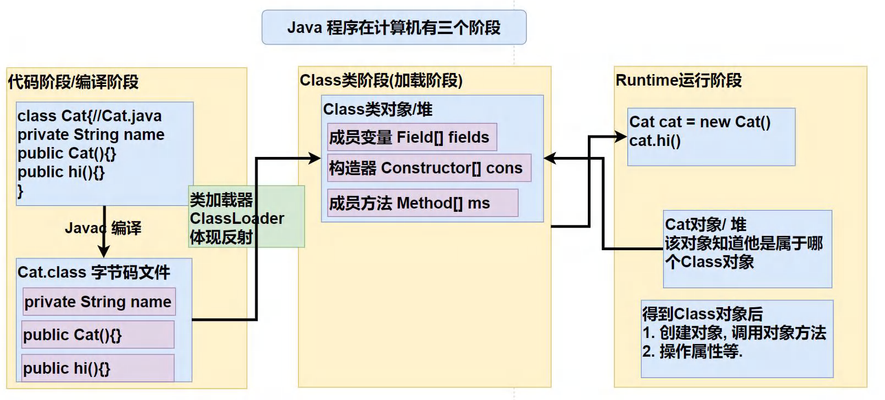
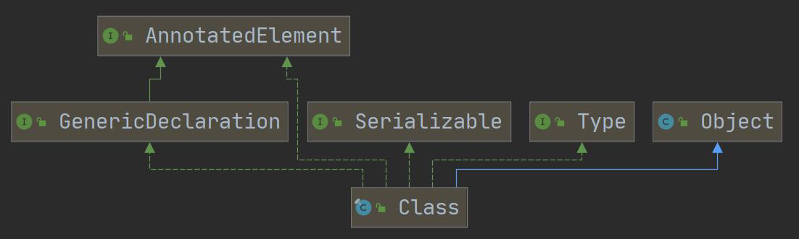
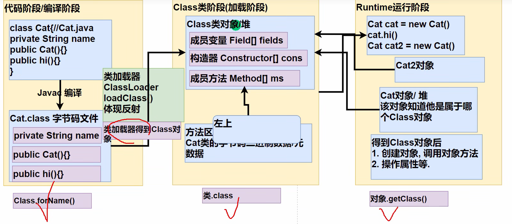
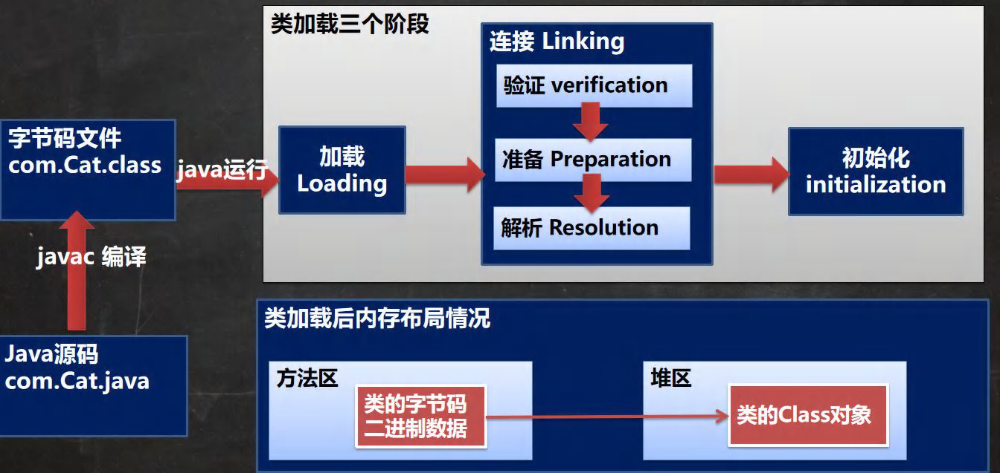
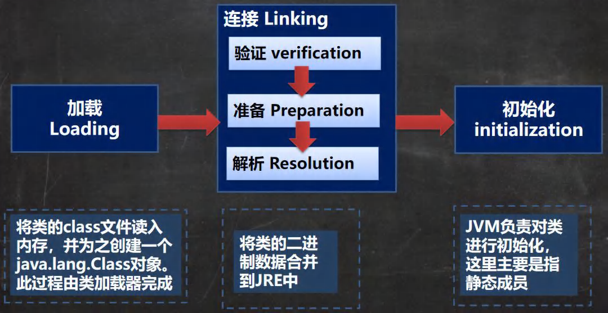

# 一、反射引出

### 一个需求

根据配置文件 re.properties 指定信息，创建 Cat 对象并调用方法 hi

~~~java
classfullpath=com.jwt.Cat
method=hi
~~~

这样的需求在学习框架时很多，**即在通过外部文件配置，在不修改源码的情况下，来控制程序**。

### 传统方法

传统的方法是先 new 一个对象，然后再调用它的方法。

~~~java
Cat cat = new Cat();
cat.hi();
~~~

通过传统方法，确实可以调用 hi() 方法，但是这和我们的需求不一样，这里我们是要根据配置文件 re.properties 指定信息来完成。可以使用 Properties 来读取配置文件。

~~~java
Properties properties = new Properties();
properties.load(new FileInputStream("src//re.properties"));
String classfullpath = properties.getProperty("classfullpath");//"com.jwt.Cat"
String methodName = properties.getProperty("method");//"hi"
System.out.println("classfullpath=" + classfullpath);
System.out.println("method=" + methodName);
~~~

然后需要创建对象，怎么创建对象呢？直接`new classfullpath`，这样不就好了嘛？嗯，想法不错，下回不要想了。现在的 classfullpath 可是字符串类型，怎么能去`new`呢。所以现有技术是做不到这个事情的。那么这里就要引入我们要将的重点——反射机制。

### 反射方法

~~~java
public class ReflectionQuestion {
    public static void main(String[] args) throws Exception {
        //1. 使用Properties 类, 可以读取配置文件
        Properties properties = new Properties();
        properties.load(new FileInputStream("src//re.properties"));
        String classfullpath = properties.getProperty("classfullpath");//"com.jwt.Cat"
        String methodName = properties.getProperty("method");//"hi"
        System.out.println("classfullpath=" + classfullpath);
        System.out.println("method=" + methodName);
      
        //2. 使用反射机制解决
        //(1) 加载类, 返回Class类型的对象cls
        Class cls = Class.forName(classfullpath);
        System.out.println("cls = " + cls);
        //(2) 通过cls得到你加载的类com.jwt.Cat的对象实例
        Object o = cls.newInstance();
        System.out.println("o 的运行类型=" + o.getClass()); //运行类型
        //(3) 通过cls得到你加载的类com.jwt.Cat的methodName "hi" 的方法对象
        Method method = cls.getMethod(methodName);
        //(4) 通过method 调用方法: 即通过方法对象来实现调用方法
        method.invoke(o); //传统方法对象.方法() , 反射机制：方法.invoke(对象)
    }
}
~~~

反射机制还有一个优点，那就是可以通过外部文件配置，在不修改源码的情况下，来控制程序。比如这里，我在Cat 类下面再写一个方法，cry()方法，如果我们使用传统方法，要调用这个方法，是不是就要修改代码了，比如`cat.cry(); `通过反射，只需在配置文件 re.properties 中，将 method=hi 改为 method=cry 就可以了。

# 二、反射机制

## 1、Java Reflection 简介

1. 反射机制允许程序在执行期借助于Reflection API取得任何类的内部信息(比如成员变量，构造器，成员方法等等)，并能操作对象的属性及方法。反射在设计模式和框架底层都会用到
2. 在运行状态中，对象可以通过反射获取他的类，类可以通过反射拿到所有⽅法(包括私有)，拿到的⽅法可以调⽤，总之通过“反射”，我们可以将Java这种静态语⾔附加上动态特性。
3. 加载完类之后，在堆中就产生一个Class类型的对象(一个类只有一个Class对象)，这个对象包含了类的完整结构信息。通过这个对象得到类的结构。这个Class对象就像一面镜子，透过这个镜子看到类的结构，所以，形象的称之为：反射

**一句话总结：反射就是在运行时才知道要操作的类是什么，并且可以在运行时获取类的完整构造，并调用对应的方法。动态特性**

## 2、反射机制原理示意



## 3、反射机制可以完成

1. 在运行时判断任意个对象所属的类
2. 在运行时构造任意一个类的对象
3. 在运行时得到任意一个类所具有的成员变量和方法
4. 在运行时调用任意一个对象的成员变量和方法
5. 生成动态代理

## 4、反射相关的主要类

java.lang.Class：代表一个类，Class 对象表示某 个类加载后在堆中的对象

java.lang.reflect.Method：代表类的方法，Method 对象表示某个类的方法

java.lang.reflect.Field：代表类的成员变量，Field 对象表示某个类的成员变量

java.lang.reflect.Constructor：代表类的构造方法，Constructor 对象表示构造器

## 5、反射的优点和缺点

- 优点：可以动态的创建和使用对象(也是框架底层核心)，使用灵活没有反射机制，框架技术就失去底层支撑。
- 缺点：使用反射基本是解释执行，对执行速度有影响.

**反射调用优化-关闭访问检查**

- Method、Field、 Constructor 对象都有 setAccessible() 方法
- setAccessible 作用是启动和禁用访问安全检查的开关
  - 参数值为 true 表示反射的对象在使用时取消访问检查，提高反射的效率。
  - 参数值为 false 则表示反射的对象执行访问检查

# 三、Class类

## 1、基本介绍 chapter23.com.hspedu.reflection.class.class01



1. Class也是类，因此也继承Object类[类图]
2. Class类对象不是new出来的，而是系统创建的[演示]
3. 对于某个类的Class类对象，在内存中只有一份，因此类只加载一次[演示]
4. 每个类的实例都会记得自己是由哪个Class实例所生成
5. 通过Ｃlass可以完整地得到一个类地完整结构，通过一系列API
6. Class对象是存放在堆地
7. 类的字节码二进制数据，是放在方法区的，有的地方称为类的元数据(包括 方法代码，变量名，方法名，访问权限等等)https://www.zhihu.com/question/38496907

## 2、Class类的常用方法

| 方法名                                             | 功能说明                                                     |
| -------------------------------------------------- | ------------------------------------------------------------ |
| static Class forName(String name)                  | 返回指定类名name的Class对象                                  |
| object newlnstance()                               | 调用缺省构造函数，返回该Class对象的一个实例                  |
| getName()                                          | 返回此Class对象所表示的实体(类、接口、数组类、基本类型等)名称 |
| Class [] getInterfaces()                           | 获取当前Class对象的接口                                      |
| ClassLoader getClassLoader()                       | 返回该类的类加载器                                           |
| Class getSuperclass()                              | 返回表示此Class所表示的实体的超类的Class                     |
| Constructor[] getConstructors()                    | 返回一个包含某些Constructor对象的数组                        |
| Field[] getDeclaredFields()                        | 返回Field对象的一个数组                                      |
| Method getMethod(String name,Class…<?> paramTypes) | 返回一个Method对象，此对象的形参类型为paramType              |

## 3、获取Class类对象



1. Class.forName

   前提：已知一个类的全名称，且该类路径下，可通过 Class 类的静态方法 forName() 获取，可能抛出ClassNotFoundException 异常

   实例：`Class cls1 = Class.forName(“java.lang.Cat”);`

   应用场景：多用于配置文件，读取类全路径，加载类

2. 类名.class

   前提：若已知具体的类，通过类的class获取，该方式最为安全可靠，程序性能最高

   实例：`Calss cls2 = Cat.class;`

   应用场景：多用于参数传递，比如通过反射得到对应构造器对象

3. 对象.getClass()

   前提：已知某个类的实例，调用该实例的 getClass() 方法获取 Class 对象

   实例：`Class cls3 = 对象.getClass();//运行类型`

   应用场景：通过创建好的对象，获取 Class 对象

4. 通过类加载器

   ```java
   ClassLoader classLoader = 对象.getClass().getClassLoader();
   Class cls4 = classLoader.loadClass(“类的全类名”)；
   ```

5. 基本数据（int,char,boolean,float,double,byte,long,short）按如下方式得到Class类对象

   ```java
   Class cls5 = 基本数据类型.class
   ```

6. 基本数据类型对应的包装类，可以通过 .TYPE 得到 Class 类对象

   ~~~java
   Class cls6 = 包装类.TYPE
   ~~~

## 4、哪些类型有Class对象

1. 外部类，成员内部类，静态内部类，局部内部类，匿名内部类
2. interface：接口
3. 数组
4. enum：枚举
5. annotation：注解
6. 基本数据类型
7. void

# 四、类加载

## 1、基本说明

**com.hspedu.classload_**

反射机制是java实现动态语言的关键，也就是通过反射实现类动态加载

1. 静态加载：编译时加载相关的类，如果没有则报错，依赖性太强

   ```java
   Dog dog = new Dog();
   ```

2. 动态加载：运行时加载需要的类，如果运行时不用该类，则不报错，降低了依赖性

   ```java
   Class cls = Class.forName("Person");
   Object o = cls.newInstance();
   Method method = cls.getMethod("hi");
   method.invoke(o);
   ```

## 2、类加载时机

- 当创建对象时（new） //静态加载
- 当子类被加载时，父类也加载 //静态加载
- 调用类中的静态成员时 //静态加载
- 通过反射 //动态加载

## 3、类加载过程图





​																									**类加载各阶段完成任务**

## 4、类加载的五个阶段

### 1、加载阶段

JVM在改阶段的主要目的是将字节码从不同的数据源（可能是 class 文件、也可能是 jar 包，甚至网络）转化为二进制字节流加载到内存中，并生成一个代表该类的 java.lang.Class 对象

### 2、连接阶段——验证

- 目的是为了确保 Class 文件的字节流中包含的信息符合当前虚拟机的要求，并且不会危害虚拟机自身的安全。

- 包括：文件格式验证（是否以魔数 oxcafebabe开头）、元数据验证、字节码验证和符号引用验证。
- 可以考虑使用 -Xverify:none 参数来关闭大部分的类验证措施，缩短虚拟机类加载的时间。

### 3、连接阶段——准备

JVM 会在该阶段对**静态变量**，分配内容并默认初始化（对应数据类型的默认初始值，如0、0L、null、false等）。这些变量所使用的内存都将在方法区中进行分配

```java
class A {
//分析类加载的链接阶段-准备属性是如何处理
//1. n1 是实例属性, 不是静态变量，因此在准备阶段，是不会分配内存
//2. n2 是静态变量，分配内存n2 默认初始化0 ,而不是20
//3. n3 是static final 是常量, 他和静态变量不一样, 因为一旦赋值就不变n3 = 30
public int n1 = 10;
public static int n2 = 20;
public static final int n3 = 30;
}
```

### 4、连接阶段——解析

虚拟机将常量池内的**符号引用**替换为**直接引用**的过程。

### 5、Initialization(初始化)

- 到初始化阶段，才真正开始执行类中定义的 Java 程序代码，此阶段是执行<clinit>()方法的过程

- <clinit>() 方法是由编译器按语句在源文件中出现的顺序，依次自动收集类中的所有**静态变量**的赋值动作和**静态代码块**中的语句，并进行合并。[ClassLoad03.java]

- 虚拟机会保证一个类的 <clinit>() 方法在多线程环境中被正确的加锁、同步，如果多个线程同时去初始化一个类，那么只会有一个线程去执行这个类的 <clinit>() 方法，其他线程都需要阻塞等待，直到活动线程执行 <clinit>() 方法完毕

# 五、通过反射获取类的结构信息

## 1、java.lang.Class类

**com.hspedu.reflection  ReflectionUtils.java**

- getName：获取全类名
- getSimpleName：获取简单类名
- getFields：获取所有public修饰的属性，包含本类以及父类的
- getDeclaredFields：获取本类中所有属性
- getMethods：获取所有public修饰的方法，包含本类以及父类的
- getDeclaredMethods：获取本类中所有方法
- getConstructors：获取本类所有public修饰的构造器
- getDeclaredConstructors：获取本类中所有构造器
- getPackage：以Package形式返回父类信息
- getSuperClass：以Class形式返回父类信息
- getInterfaces：以Class[]形式返回接口信息
- getAnnotations：以Annotation[]形式返回注解信息

## 2、java.lang.reflect.Field类

- getModifiers：以int形式返回修饰符
  - 说明：默认修饰符是0，public是1，private是2，protected是4，static是8，final是16

- getType：以Class形式返回类型

- getName：返回属性名

## 3、java.lang.reflect.Mehod类

- getModifiers：以int形式返回修饰符
  - 说明：默认修饰符是0，public是1，private是2，protected是4，static是8，final是16

- getReturnType：以Class形式获取返回类型

- getName：返回方法名

- getParameterTypes：以Class[]返回参数类型数组

## 4、java.lang.reflect.Constructor类

- getModifiers：以int形式返回修饰符
- getName：返回构造器名（全类名）
- getParameterTypes：以Class[]返回参数类型数组

# 六、通过反射创建对象

**com.hspedu.reflection.ReflectionCreateInstance**

- 方式一：调用类中的public修饰的无参构造器创建对象
- 方式二：调用类中的指定构造器创建对象

## Class类相关方法

- newInstance() 调用类中的无参构造器，获取对应类的对象
- getConstructor(Class...clazz) 根据参数列表，获取对应的public构造器对象
- getDecalaredConstructor(Class...cazz) 根据参数列表，获取对应的所有构造器对象

## Constructor类相关方法

- setAccessible：爆破（形参填入true，即可访问私有构造方法、变量、方法等）
- newInstance(Object…obj)：调用构造器

# 七、反射访问类中的成员

## 1、访问属性

- 1.根据属性名获取Field对象
  - `Field f = class对象.getDeclaredField(属性名);`

- 2.暴破
  - `f.setAccessible(true); //f是Field`

- 3.访问
  - `f.set(o,值); //o表示对象`
  - `f.get(o); //o表示对象`

- 4.注意：如果是静态属性，则set和get中的参数o，可以写成null

## 2、访问方法

- 1.根据方法名和参数列表获取Method方法对象
  - `Method m = class对象.getDeclaredMethod(方法名，XX.class);`
- 2.获取对象: `Object o = class对象.newlnstance();`
- 3.暴破: `m.setAccessible(true);`
- 4.访问: `Object returnValue = m.invoke(o,实参列表);`
- 5.注意:如果是静态方法，则invoke的参数o，可以写成null!