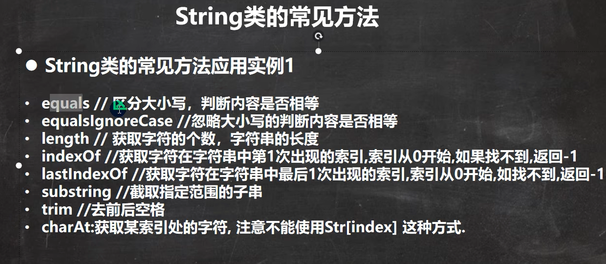
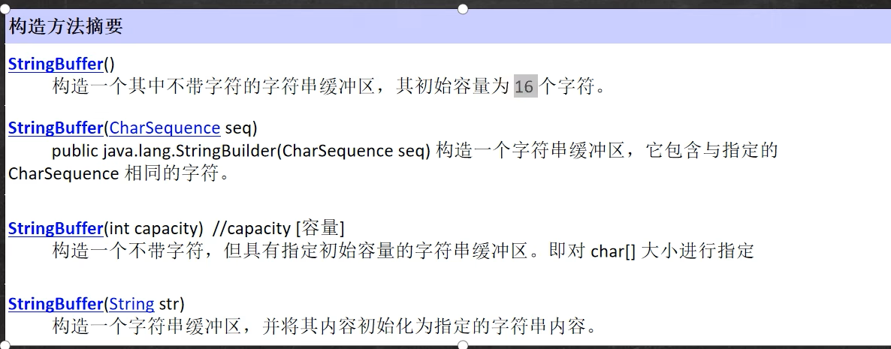
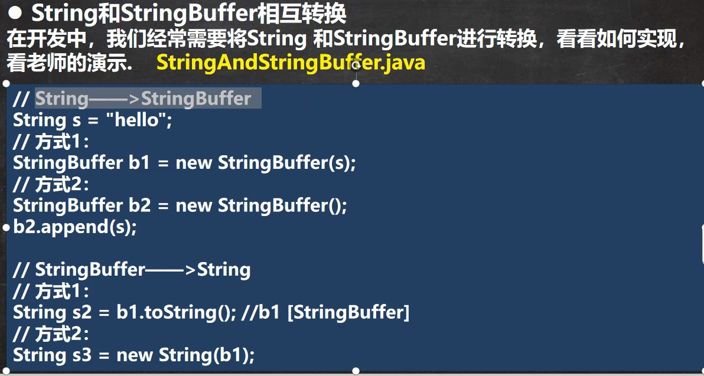

# 一、包装类

## 1、包装类的分类

1. 针对八种基本定义相应的引用类型---包装类

2. 有了类的特点，就可以调用类中的方法

   

   

## 2、包装类和基本数据的转换

1. jdk5之前的手动装箱和拆箱方式，**装箱**：基本类型->包装类型，反之，拆箱
2. jdk5以后(含jdk5)的自动装箱和拆箱方式
3. 自动装箱底层调用的是valueOf方法，比如Integer.valueOf()
4. 其他包装类的用法类似

## 3、包装类型和String类型的相互转换

## 4、Integer类和Character类的常用方法

# 二、String类

## 1、String类理解和创建对象

1. String对象用于保存字符串，也就是一组字符序列

2. 字符串常量对象是用双引号括起的字符序列，例如：“你好”、”12.97“、”boy“等

3. 字符串的字符使用Unicode字符编码，一个字符(不区分字母还是汉字)占两个字节

4. String类较常用构造器(其它看手册)：

   - String s1 = new String()；
   - String s2 = new String(String original);
   - String s3 = new String(char[] a);
   - String s4 = new String(char[] a,int startIndex,int count);
   - String s5 = new String(byte[] b)

   

5. String 类实现了接口Serializable [String可以串行化：可以在网络传输]

   ​									comparable[String对象可以比较大小]

6. String是final类，不能被其他类继承

7. String 有属性private final char value[]；用于存放字符串内容

8. 一定要注意：value 是一个final类型，不可以修改：即value不能指向新的地址，但是单个字符内容是可以变化

## 2、创建String对象的两种方式

1. 方式一：直接赋值String s = "hspedu"；
2. 方式二：调用构造器 String s = new String("hspedu");

## 3、两种创建String对象的区别

方式一：直接赋值String s = "hspedu"；

方式二：调用构造器 String s = new String("hspedu");

1. 方式一：先从常量池查看是否有"hsp"数据空间，如果有，直接指向；如果没有则重新创建，然后指向。s最终指向的是常量池的空间地址

2. 方式二：先在堆中创建空间，里面维护了value属性，指向常量池的hsp空间，如果常量池没有"hsp"，重新创建，如果有，直接通过value指向。最终指向的是堆中的空间地址

3. 画出两种方式的内存分布图

   

## 4、字符串的特性

1. String是一个final类，代表不可变的字符序列

2. 字符串是不可变的。一个字符串对象一旦被分配，其内容是不可变的。

   

## 5、String类的常见方法

1. 说明：String类是保存字符串常量的。每次更新都需要重新开辟空间，效率较低，因此java设计者还提供了StringBuilder和StringBuffer来增强String的功能，并提高效率 

   

   
   
    

# 三、StringBuffer类

## 1、基本介绍

1. java.lang.StringBuffer代表可变的字符序列，可以对字符串内容进行增删

2. 很多方法与String相同，但StringBuffer是可变长度的

3. StringBuffer是一个容器

   

## 2、StringVSStringBuffer

1. String保存的是字符串常量，里面的值不能更改，每次String类的更新实际上就是更改地址，效率较低//private final char value[];
2. StringBuffer保存的是字符串变量，里面的值可以更改，每次StringBuffer的更新实际上可以更新内容，不用每次更新地址，效率较高//char[] value； //这个放在堆

## 3、StringBuffer的构造器

# 四、StringBuilder类

## 1、基本介绍

1. 一个可变的字符序列。此类提供一个与StringBuilder兼容的API，但不保证同步(StringBuilder不是线程安全)。该类被设计用作StringBuffer的一个简易替换，用在字符串缓冲区被单个线程使用的时候。如果可能，建议优先采用该类，因为在大多数实现中，它比StringBuffer要快
2. 在StringBuilder上的主要操作时append和insert方法，可重载这些方法，以接受任意类型的数据

## 2、StringBuilder常用方法

## 3、比较

# 五、Math类

## 1、基本介绍

Math类包含用于执行基本数学运算方法，如初等指数、对数、平方根和三角函数

## 2、Math类常用方法应用案例

# 六、Arrays类

## 1、Arrays类常见方法应用案例

Arrays里面包含了一系列静态方法，用于管理或操作数组(比如排序和搜索) ArraysMethod01.java

1. toString返回数组的字符串形式Arrays.toString(arr)

2. sort排序(自然排序和定制排序)     Integer arr[] = {1,-1,7,0,89};ArraysSortCustom.java

3. binarySearch 通过二分搜索法进行查找，要求必须排好序

   int index = Arrays.binarySearch(arr,3);

   

# 七、System类

## 1、System类常见方法和案例

1. exit退出当前程序

2. arraycopy：复制数组元素，比较适合底层调用，一般使用Arrays.copyOf完成复制数组

   int[] src = {1,2,3};

   int[] dest = new int[3];

   System.arraycopy(src,0,dest,0,3);

3. currentTimeMillens：返回当前时间距离1970-1-1的毫秒数

4. gc：运行垃圾回收机制System.gc();

# 八、BigInteger和BigDecimal类

## 1、BigInteger和BigDecimal常见方法

1. add加
2. subtract减
3. multiply乘
4. divide除

# 九、日期类

## 1、第一代日期类

1. date：精确到毫秒，代表特定的瞬间

2. SimpleDateFormat：格式和解析日期的类

   SimpleDateFormat格式化和解析日期的具体类。它允许进行格式化(日期->文本)、解析(文本->日期)和规范化

3. 应用实例Date_.java

   

   

## 2、第二代日期类

1. 第二代日期类，主要就是Calendar类(日历)

   

## 3、第三代日期类

前面两代日期类的不足分析

JDK 1.0中包含了一个java.util.Date类，但是它的大多数方法已经在JDK 1.1引入Calendar类之后被弃用了。而Calendart也存在问题是：

1. 可变性：像日期和时间这样的类应该是不可变的
2. 偏移性：Date中的年份是从1900开始的，而月份都是从0开始
3. 格式化：格式化只对Date有用，Calendar则不行
4. 此外，它们也不是线程安全的；不能处理闰秒等（每隔2天，多出1s）

## 4、第三代日期类常见方法

1. LocalDate(日期/年月日)，LocalTime(时间/时分秒)，LocalDateTime(日期时间/年月日时分秒)JDK8引入

   

2. DateTimeFormatter格式日期类

   类似于SimpleDateFormat
   
   DateTimeFormat dtf = DateTimeFormatter.ofPattern(格式);
   
   String str = dtf.format(日期对象)
   
3. Instant 时间戳

   

4. 

