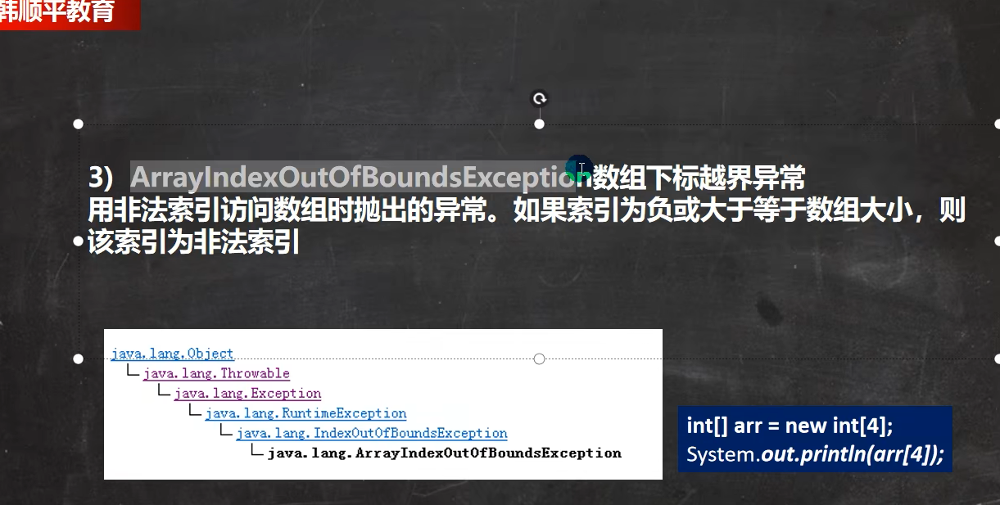
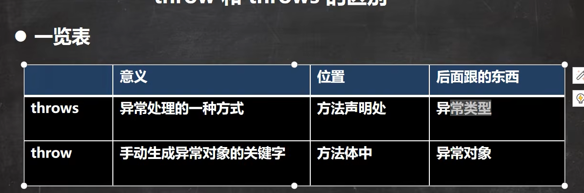

# 一、异常介绍

## 1、基本概念

Java语言中，将程序执行中发生的不正常情况称为"异常"。(开发过程中的语法错误和逻辑错误不是异常)

## 2、执行过程中所发生的异常事件可分为两大类

1. Error(错误)：Java虚拟机无法解决的严重问题。如：JVM系统内部错误、资源耗尽等严重错误。比如：StackOverflowError[栈溢出]和OOM(out of memory)，Error是严重错误，程序会崩溃
2. Exception：其他因编程错误或偶然的外在因素导致的一般性问题，可以使用针对性的代码进行处理。例如空指针访问，试图读取不存在的文件，网络连接中断等等，Exception分为两大类：**运行时异常**[程序运行时，发生的异常]和**编译时异常**[编译时，编译器检查出的异常]

# 二、异常体系图一栏

## 1、异常体系图的小结

1. 异常分为两大类，运行时异常和编译时异常
2. 运行时异常，编译器检查不出来。一般是指编程时的逻辑错误，是程序员应该避免其出现的异常。java.lang.RuntimeException类及它的子类都是运行时异常
3. 对于运行时异常，可以不做处理，因为这类异常很普遍，若全处理可能会对程序的可读性和运行效率产生影响
4. 编译时异常，是编译器要求必须处置的异常

# 三、常见的运行时异常

## 1、常见的运行时异常包括

1. NullPointerException：空指针异常
2. ArithmeticException：数学运算异常
3. ArrayIndexOutOfBoundsException：数组下标越界异常
4. ClassCastException：类型转换异常
5. NumberFormatException：数字格式不正确异常

# 四、编译异常

## 1、介绍

编译异常是指在编译期间，就必须处理的异常，否则代码不能通过编译

## 2、常见的编译异常

SQLException：操作数据库时，查询表可能发生异常

IOException：操作文件时，发生的异常

FileNotFoundException：当操作一个不存在的文件时，发生异常

ClassNotFoundException：加载类，而该类不存在时，异常

EOFException：操作文件，到文件末尾，发生异常

IllegalArguementException：参数异常

# 五、异常处理

## 1、基本介绍

异常处理就是当异常发生时，对异常处理的方式

## 2、异常处理的方式

1. try-catch-finally

   程序员在代码中捕获发生的异常，自行处理

   

   

2. throws

   将发生的异常抛出，交给调用者(方法)来处理，最顶级的处理者就是JVM

   

# 六、try-catch异常处理

## 1、try-catch方式处理异常说明

1. Java提供try和catch块来处理异常。try块用于包含可能出错的代码。catch块用于处理try块中发生的异常。可以根据需要在程序中有多个try..catch块

2. 基本语法

   try{

   ​	//可疑代码

   ​	//将异常生成对应的异常对象，传递给catch块

   }catch(异常){

   ​	//对异常的处理

   }

   //如果没有finally，语法是可以通过

## 2、try-catch方式处理异常-注意事项

1. 如果异常发生了，则异常发生后面的代码不会执行，直接进入到catch块。

2. 如果异常没有发生，则顺序执行try的代码块，不会进入到catch

3. 如果希望不管是否发生异常，都执行某段代码(比如关闭连接，释放资源等)则使用如下代码-finally{}

   

4. 可以有多个catch语句，捕获不同的异常(进行不同的业务处理)，要求父类异常在后，子类异常在前，比如(Exception在后，NullPointerException在前)，如果发生异常，只会匹配一个catch

   

5. 可以进行try-catch-finally配合使用，这种用法相当于没有捕获异常，因此程序会直接崩掉。应用场景，就是执行一段代码，不管是否发生异常，都必须执行某个业务逻辑

   

## 3、try-catch-finally执行顺序小结

1. 如果没有出现异常，则执行try块中所有语句，不执行catch块中语句，如果有finally，最后还需要执行finally里面的语句
2. 如果出现异常，则try块中异常发生后，剩下的语句不在执行。将执行catch块中的语句，如果有finally，最后还需要执行finally里面的语句

# 七、throws异常处理

## 1、基本介绍

1. 如果一个方法(中的语句执行时)可能生成某种异常，但是并不确定如何处理这种异常，则此方法应显示地声明抛出异常，表示该方法将不对这些异常进行处理，而由该方法的调用者负责处理
2. 在方法声明中用throws语句可以声明抛出异常的列表，throws后面的异常类型可以时方法中产生的异常类型，也可以是它的父类

## 2、注意事项和使用细节

1. 对于编译异常，程序中必须处理，比如try-catch或者throws
2. 对于运行时异常，程序中如果没有处理，默认就是throws的方式处理
3. 子类重写父类的方式时，对抛出异常的规定：子类重写的方法，所抛出的异常类型要么和父类抛出的异常一致，要么为父类抛出的异常的类型的子类型
4. 在throws过程中，如果有方法try-catch，就相当于处理异常，就可以不必throws

# 八、自定义异常

## 1、基本概念

当程序中出现了某些"错误"，但该错误信息并没有在Throwable子类中描述处理，这个时候可以自己设计异常类，用于描述该错误信息

## 2、自定义异常的步骤

1. 定义类：自定义异常类名(程序员自己写)继承Exception或RuntimeException
2. 如果继承Exception，属于编译异常
3. 如果继承RuntimeException，属于运行异常(一般来说，继承RuntimeException)

# 九、throwVSthrows的区别

