# 一、枚举

## 1、enum关键字实现枚举

- enum关键字实现枚举注意事项

  1. 当我们使用enum关键字开发一个枚举类时，默认会继承Enum类，而且是个final。使用javap工具演示

     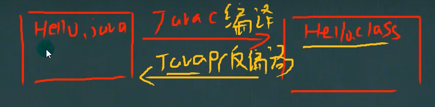

     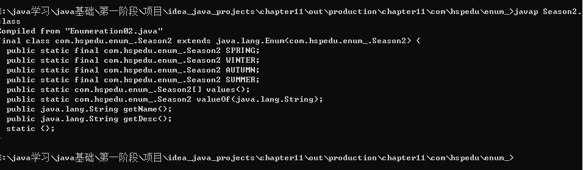

  2. 传统的public  static  final  Season2 SPRING =  new  Season2(“春天”,“温暖”)；简化成SPRING(“春天”,“温暖”)，这里必须知道，它调用的是哪个构造器

  3. 如果使用无参构造器 创建 枚举对象，则实列表和小括号都可以省略

  4. 当有多个枚举对象时，使用，逗号间隔，最后有一个分号结尾

  5. 枚举对象必须放在枚举类的行首

## 2、enum常用方法引用实例

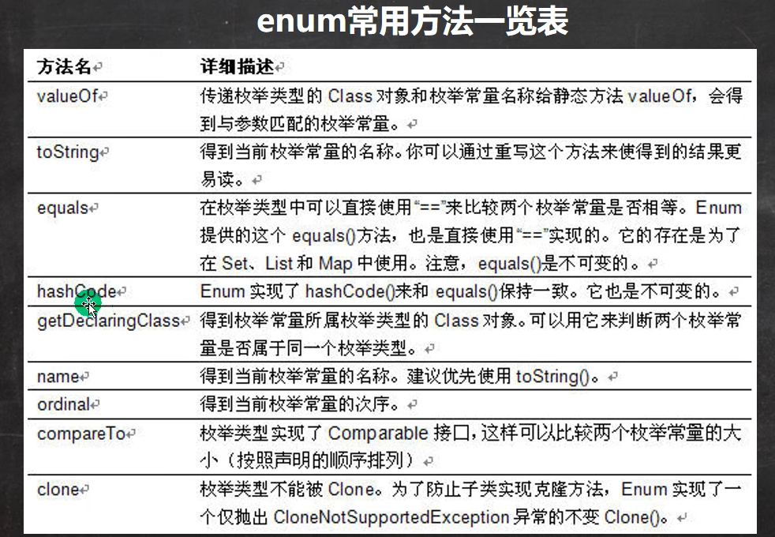

举例说明enum常用的方法的使用，对Season2测试。EnumMethod.java

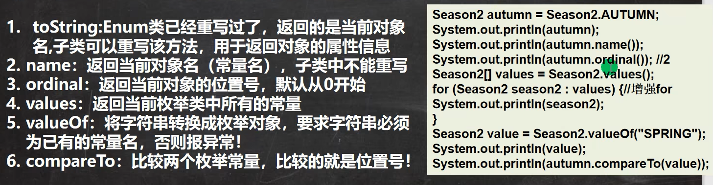

## 3、enum实现接口

1. 使用enum关键字后，就不能再继承其他类了，因为enum会隐式继承Enum，而Java式单继承机制

2. 枚举类和普通类一样，可以实现接口，如下形式

   enum	类名	implements	接口1，接口2{}

# 二、注解

## 1、注解的理解

1. 注解(Annotation)也被称为元数据(Metadata)，用于修饰解释 包、类、方法、属性、构造器、局部变量等数据信息
2. 和注释一样，注解不影响程序逻辑，但注解可以被编译或运行，相当于嵌入在代码中的补充信息
3. 在JavaSE中，注解的使用目的比较简单，例如标记过时的功能，忽略警告等。在JavaEE中注解占据了更重要的角色，例如用来配置应用程序的任何切面，代替java EE旧版中所遗留的繁重

## 2、基本的Annotation介绍

使用Annotation时要在其前面增加@符号，并把该Annotation当成一个修饰符使用。用于修饰它支持的程序元素

- 三个基本的Annotation：

  1. @Override：限定某个方法，是重写父类方法，该注解只能用于方法
  2. @Deprecated：用于表示某个程序元素(类，方法等)已过时
  3. @SuppressWarnings：抑制编译器警告

- @Override注解的案例 Override_.java

  @interface不是interface，是注解类

  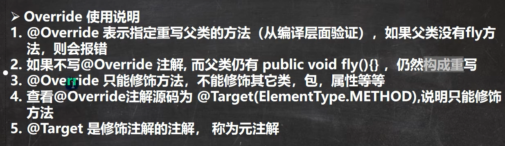

- @Deprecated注解的案例 Deprecated_.java

  @Deprecated：用于表示某个程序元素(类，方法等)已过时

  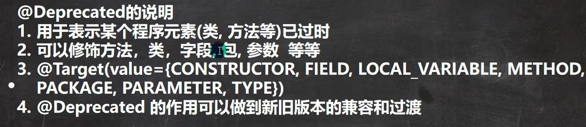

- @SuppressWarnings注解的案例

  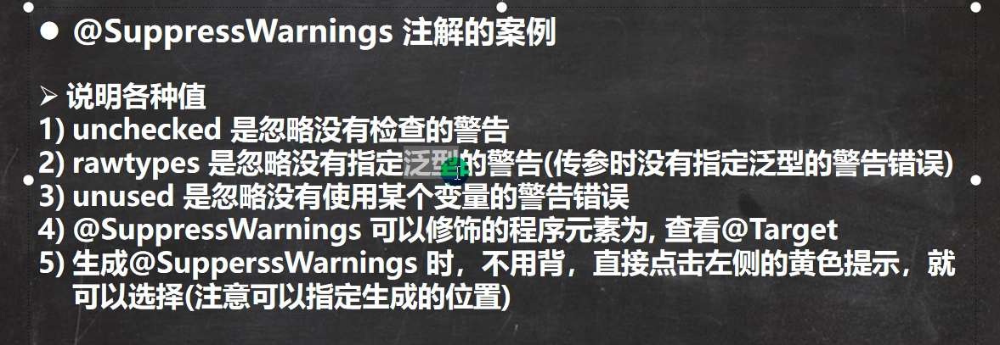

## 3、JDK的元Annotation(元注解,了解)

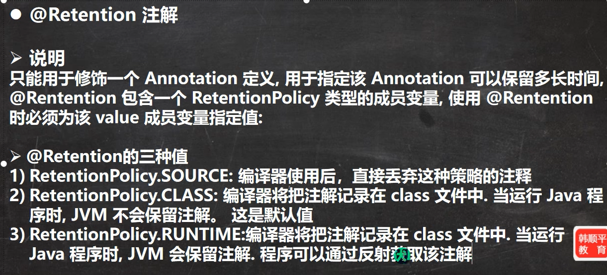

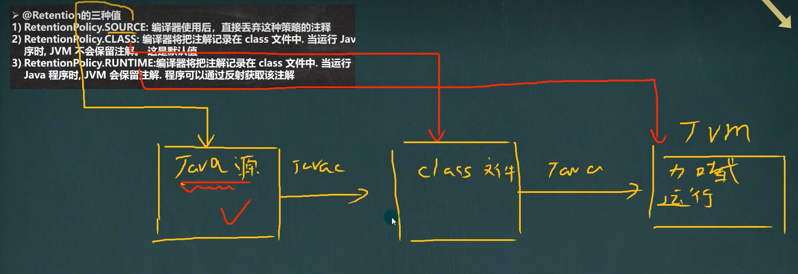

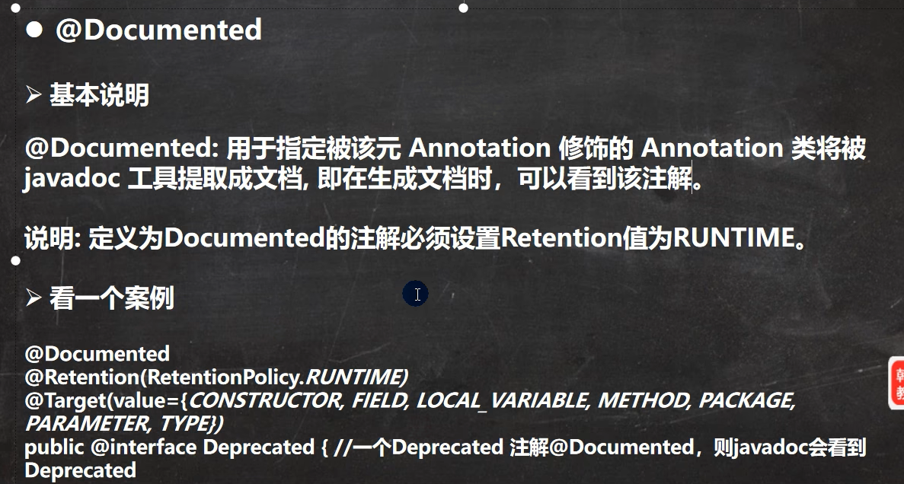

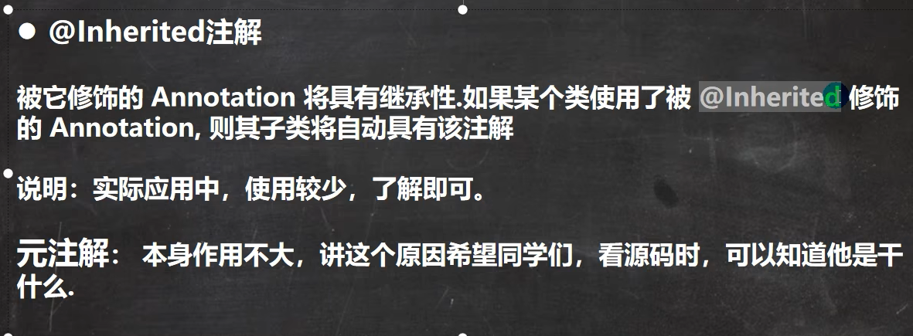

