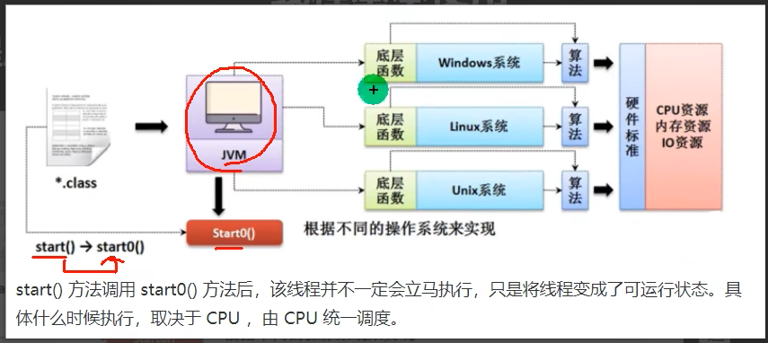
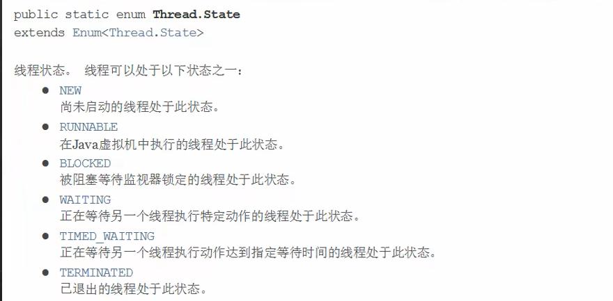
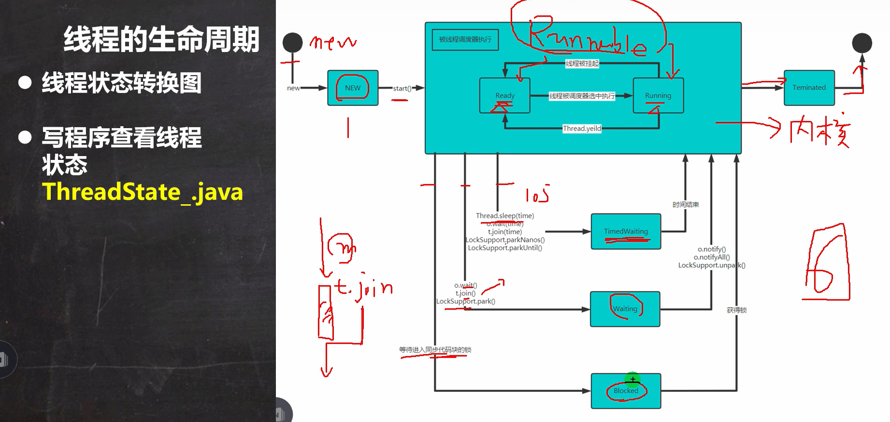

# 一、线程概念

## 1、程序（program）

是为完成特定任务、用某种语言编写的一组指令的集合

## 2、进程

1. 进程是指运行中的程序，比如我们使用QQ，就启动了一个进程，操作系统就会该进程分配内存空间。当我们使用迅雷，又启动了一个进程，操作系统将为迅雷分配新的内存空间
2. 进程是程序的一次执行过程，或是正在运行的一个程序。是动态过程：有它自身的产生、存在和消亡的过程

## 3、什么是线程

1. 线程由进程创建的，是进程的一个实体
2. 一个进程可以拥有多个线程

## 4、其他相关概念

1. 单线程：同一个时刻，只允许执行一个线程
2. 多线程：同一个时刻，可以执行多个线程，比如：一个qq进程，可以同时打开多个聊天窗口，一个迅雷进程，可以同时下载多个文件
3. 并发：同一个时刻，多个任务交替执行，造成一种“貌合神离”的错觉，简单的说，单核cpu实现的多任务就是并发
4. 并行：同一个时刻，多个任务同时执行。多核cpu可以实现

# 二、线程基本使用

## 1、创建线程的两种方式

在java中线程来使用有两种方法

1. 继承Thread类，重写run方法
2. 实现Runnable接口，重写run方法

使用JConsole监控线程执行情况

## 2、线程应用案例1-继承 Thread 类创建线程

## 3、线程应用案例2-实现Runnable接口

1. java是单继承的，在某些情况下一个类可能已经继承了某个父类，这时在用继承Thread类方法来创建线程显然不可能了
2. java设计者们提供了另外一个方式创建线程，就是通过实现Runnable接口来创建线程

案例：**Thread02.java**

这里底层使用了设计模式[代理模式]

代码模拟实现 Runnable 接口开发线程的机制：

## 4、继承Thread vs 实现Runnable的区别

1. 从java的设计来看，通过继承Thread或者实现Runnable接口来创建线程本质上没有区别，从jdk帮助文档我们可以看到Thread类本身就实现了Runnable接口
2. 实现Runnable接口方式更加适合多个线程共享一个资源的情况，并且避免了单继承的限制
3. [售票系统]，编程模拟三个售票窗口售票100，分别使用继承Thread和实现Runnable方式，并分析有什么问题？SellTicket.java

# 三、线程终止

## 1、基本说明

1. 当线程完成任务后，会自动退出
2. 还可以通过使用变量来控制run方法退出的方式停止线程，即通过方式

# 四、线程常用方法

## 1、常用方法第一组

1. setName //设置线程名称，使之与参数name 相同
2. getName //返回该线程的名称
3. start //使该线程开始执行；Java虚拟机底层调用该线程的start0方法
4. run //调用线程对象run方法
5. setPriority //更改线程的优先级
6. getPriority //获取线程的优先级
7. sleep //在指定的毫秒数内让当前正在执行的线程休眠(暂停执行)
8. interrupt //中断线程

## 2、注意事项和细节

1. start 底层会创建新的线程，调用run，run就是一个简单的方法调用，不会启动新线程
2. 线程优先级的范围
3. interrupt，中断线程，但并没有真正的结束线程。所以一般用于中断正在休眠线程
4. sleep 线程的静态方法，使当前线程休眠

## 3、常用方法第二组

1. yield：线程的礼让。让出cpu，让其他线程执行，但礼让的时间不确定，所以也不一定礼让成功
2. join：线程的插队。插队的线程一旦插队成功，则肯定先执行完插入的线程所有的任务

## 4、用户线程和守护线程

1. 用户线程：也叫工作线程，当线程的任务执行完或通知方式结束
2. 守护线程：一般是为工作线程服务的，当所有的用户线程结束，守护线程自动结束
3. 常见的守护线程：垃圾回收机制

## 5、线程的生命周期

- JDK中用Thread.State枚举表示了线程的几种状态

  

  

# 五、线程同步-Synchronized

## 1、线程同步机制

1. 在多线程编程，一线敏感数据不允许被多个线程同时访问，此时就使用同步访问技术，保证数据在任何时刻，最多有一个线程访问，以保证数据的完整性
2. 也可以这里理解：线程同步，即当有一个线程在对内存进行操作时，其他线程都不可以对这个内存地址进行操作，直到该线程完成操作，其他线程才能对该内存地址进行操作

## 2、同步具体方法-Synchronized

1. 同步代码块

   synchronized(对象) { //得到对象的锁，才能操作同步代码

   ​	//需要被同步代码；

   }

2. synchronized还可以放在方法声明中，表示整个方法-为同步方法

   public synchronized void m(String name){

   ​	//需要被同步的代码

   }

# 六、互斥锁

## 1、基本介绍

1. Java语言中，引入了对象互斥锁的概念，来保证共享数据操作的完整性
2. 每个对象都对应于一个可称为“互斥锁”的标记，这个标记用来保证在任一时刻，只能有一个线程访问该对象
3. 关键字synchronized 来与对象的互斥锁联系。当某个对象用synchronized修饰时，表明该对象在任一时刻只能由一个线程访问
4. 同步的局限性：导致程序的执行效率要降低
5. 同步方法(非静态的)的锁可以是this，也可以是其他对象(要求是同一个对象)
6. 同步方法(静态的)的锁为当前类本身

## 2、注意事项和细节

1. 同步方法如果没有使用static修饰：默认锁对象为this
2. 如果方法使用static修饰，默认锁对象：当前类.class
3. 实现的落地步骤：
   - 需要先分析上锁的代码
   - 选择同步代码块或同步方法
   - 要求多个线程的锁对象为同一个即可

# 七、线程的死锁

## 1、基本介绍

多个线程都占用了对方的锁资源，但不肯相让，导致了死锁，在编程时一定要避免死锁的发生   DeadLock.java

# 八、释放锁

- 下面操作会释放锁

  1. 当前线程的同步方法、同步代码块执行结束

     案例：上厕所，完事出来

  2. 当前线程在同步代码块、同步方法中遇到break、return

     案例：没有正常的完事，经理叫他修改bug，不得已出来

  3. 当前线程在同步代码块、同步方法中出现了未处理的Error或Exception，导致异常结束

     案例：没有正常的完事，发现忘带纸，不得已出来

  4. 当前线程的同步代码块、同步方法中执行了线程对象的wait()方法，当前线程暂停，并释放锁

     案例：没有正常完事，觉得需要酝酿下，所以出来等会再进去

- 下面操作不会释放锁

  1. 线程执行同步代码块或同步方法时，程序调用Thread.sleep()、Thread.yield()方法暂停当前线程的执行，不会释放锁

     案例：上厕所，太困了，在坑位上眯了一会

  2. 线程执行同步代码块时，其他线程调用了该线程的suspend()方法将该线程挂起，该线程不会释放锁

     提示：应尽量避免使用suspend()和resume()来控制线程，方法不再推荐使用