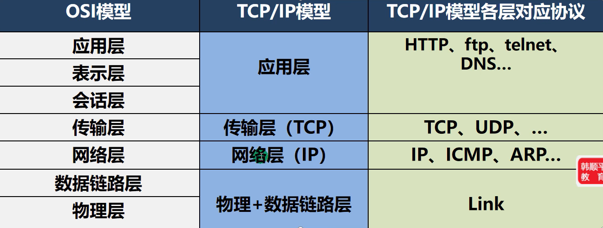
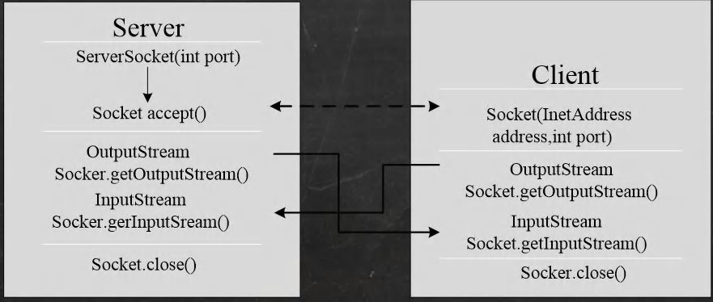
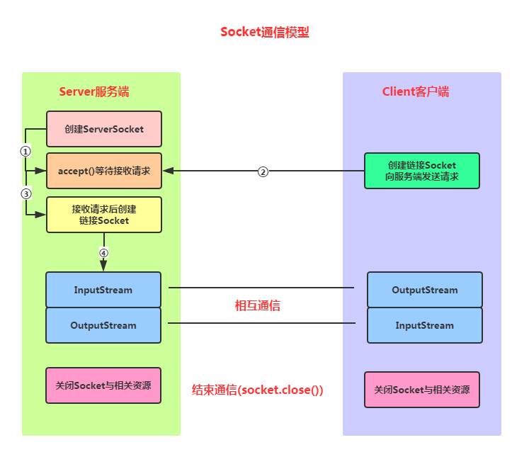

# 一、网络的相关概念

## 1、网络通信

1. 概念：两台设备之间通过网络实现数据传输
2. 网络通信：将数据通过网络从一台设备传输到另一台设备
3. java.net包下提供了一系列的类或接口，供程序员使用，完成网络通信

## 2、网络

1. 概念：两台或设备通过一定物理设备连接起来构成了网络
2. 根据网络的覆盖范围不同，对网络进行分类：
   - 局域网：覆盖范围小，仅仅覆盖一个教室或一个机房
   - 城域网：覆盖范围较大，可以覆盖一个城市
   - 广域网：覆盖范围最大，可以覆盖全国，甚至全球，万维网是广域网的代表

## 3、ip地址

1. 概念：用于唯一标识网络中的每台计算机/主机
2. 查看ip地址：ipconfig
3. ip地址的表示形式：点分十进制  xx.xx.xx.xx
4. 每一个十进制数的范围：0~255
5. ip地址的组成=网络地址+主机地址 ，比如：192.168.16.69
6. IPv6是互联网工程任务组设计的用于代替IPv4的下一代IP协议，其地址数量号称可以为全世界的每一粒沙子编上一个地址
7. 由于IPv4最大的问题在于网络地址资源有限，严重制约了互联网的应用和发展。IPv6的使用，不仅能解决网络地址资源数量的问题，而且也解决了多种接入设备连入护互联网的障碍

## 4、域名

1. www.baidu.com
2. 好处：为了方便记忆，解决记ip的困难
3. 概念：将ip地址映射成域名

## 5、端口号

1. 概念：用于表示计算机上某个待定的网络程序
2. 表示形式：以整数形式，范围0~65535
3. 0~1024已经被占用，比如  ssh22，ftp21，smtp25，http80
4. 常见的网络端口号：
   - tomcat：8080
   - mysql：3306
   - oracle：1521
   - sqlserver：1433

## 6、网络通信协议

## 7、TCP和UDP

- TCP协议：传输控制协议
  1. 使用TCP协议前，须先建立TCP连接，形成传输数据通道
  2. 传输前，采用“三次握手”方式，是**可靠的**
  3. TCP协议进行通信的两个应用进程：客户端，服务端
  4. 在连接中可进行大数据量的传输
  5. 传输完毕，需释放已建立的连接，**效率低**
- UPD协议：用户数据协议
  1. 将数据、源、目的封装成数据包，不需要建立连接
  2. 每个数据报的大小限制在**64K**内，不适合传输大量数据
  3. 因无需连接，故是**不可靠的**
  4. 发送数据结束时无需释放资源(因为不是面向连接的)，**速度快**
  5. 举例：厕所通知：发短信

#  二、InetAddress类

## 1、相关方法

1. getLocalHost() 获取本机InetAddress对象
2. getByName() 根据指定主机名/域名获取 ip 地址对象
3. getHostName() 获取 InetAddress 对象的主机名
4. getHostAddress() 获取 InetAddress 对象的地址

# 三、Socket

### 1、基本介绍

1. 套接字(Socket)开发网络应用程序被广泛采用，以至于成为事实上的标准。
2. 通信的两端都要有Socket，是两台机器间通信的端点。
3. 网络通信其实就是 Socket 间的通信。
4. Socket 允许程序把网络连接当成一个流，数据在两个 Socket 间通过 IO 传输。
5. 一般主动发起通信的应用程序属客户端，等待通信请求的为服务端。

# 四、TCP网络通信编程

## 1、简介

1. 基于客户端-服务端的网络通信
2. 底层使用的是TCP/IP协议
3. 应用场景举例:客户端发送数据，服务端接受并显示控制台

## 2、流程

TCP，传输前先开服务端，accept，等客户端接入，然后获得客户端 socket 然后进行 IO 操作

#### 服务端编写

- Step 1

  ：创建ServerSocket对象，绑定监听的端口

  - ServerSocket serverSocket = new ServerSocket(Port);

- Step 2

  ：调用accept()方法监听客户端的请求

  - Socket socket = serverSocket.accept();

- step 3

  ：连接建立后，通过输入流读取客户端发送的请求信息

  - InputStream inputStream = socket.getInputStream();

- Step 4

  ：通过输出流向客户端发送响应信息

  - OutputStream outputStream = socket.getOutputStream();

- Step 5

  ：关闭相关资源

  - outputStream.close();
  - inputStream.close();
  - socket.close();
  - serverSocket.close();

#### 客户端编写

- **Step 1**：创建Socket对象，指明需要链接的服务器的地址和端号
  - Socket socket = new Socket(“server address”, port);
- **Step 2**：链接建立后，通过输出流向服务器发送请求信息
  - OutputStream outputStream = socket.getOutputStream();
- **Step 3**：通过输入流获取服务器响应的信息
  - InputStream inputStream = socket.getInputStream();
- **Step 4**：关闭相关资源
  - inputStream.close();
  - outputStream.close();
  - socket.close();

## 3、netsata指令

1. netstat -an 可以查看当前主机网络情况，包括端口监听情况和网络连接情况
2. netstat -an | more 可以分页显示
3. 要求再dos控制台下执行 win+r

说明：

1. Listening 表示某个端口在监听
2. 如果有一个外部程序(客户端)连接到该端口，就会显示一条连接信息

## 4、TCP网络通讯不为人知的秘密

1. 当客户端连接到服务端后，实际上客户端也是通过一个端口和服务端进行通讯的，这个端口是TCP/IP来分配的，是不确定的随机的

# 五、UDP网络通信编程

## 1、基本介绍

1. 类 DatagramSocket 和 DatagramPacket [数据包/数据报]实现了基于UDP协议网络程序
2. UDP数据报通过数据报套接字 DatagramSocket 发送和接收，系统不保证UDP数据报一定能够安全送到目的地，也不能确定什么时候可以抵达
3. DatagramPacket 对象封装了UDP数据报，在数据报中包含了发送端的IP地址和端口号以及接收端的IP地址和端口号
4. UDP协议中每个数据报都给出了完整的地址信息，因此无须建立发送方和接收方的连接

## 2、流程

UDP，以数据报作为数据的传输载体，在进行传输时首先要把传输的数据定义成数据报(Datagram)，在数据报中指明数据要到达的Socket(主机地址和端口号)，然后再将数据以数据报的形式发送出去，然后就没有然后了，服务端收不收到我就不知道了，除非服务端收到后又给我回一段确认的数据报。

#### 接收端编写

- **Step 1**：创建DatagramSocket，指定端口号
  - DatagramSocket socket = new DatagramSocket(9999);
- **Step 2**：创建DatagramPacket
  - DatagramPacket packet = new DatagramPacket(buf,buf.length);
- **Step 3**：接收发送端发送的数据信息
  - socket.receive(packet);
- **Step 4**：读取数据
  - packet.getLength();
  - packet.getData();
- **Step 5**：关闭相关资源
  - socket.close();

#### 发送端编写

- **Step 1**：定义发送信息
  - byte[] data = “发送端：hello 明天吃火锅~”.getBytes();
- **Step 2**：创建DatagramPacket，包含将要发送的信息
  - DatagramPacket packet = new DatagramPacket(data, data.length, InetAddress.getByName(“jianjian”), 9999);
- **Step 3**：创建DatagramSocket
  - DatagramSocket socket = new DatagramSocket(9998);
- **Step 4**：发送数据
  - socket.send(packet);
- **Step 5**：关闭相关资源
  - socket.close();

