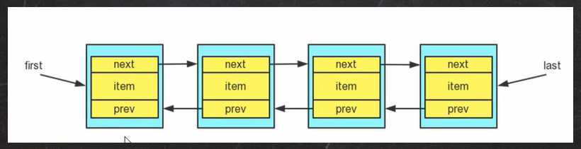
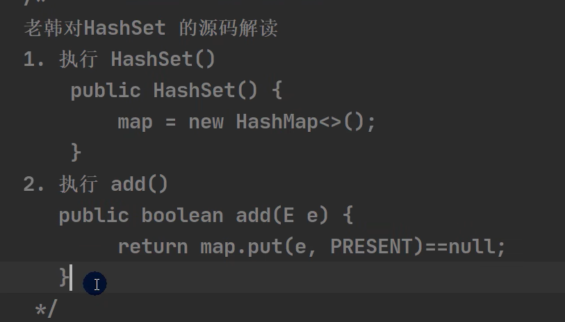
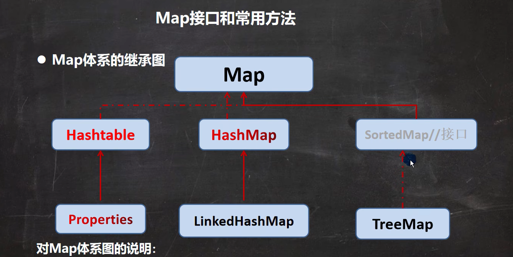

# 一、集合介绍

## 1、集合的理解和好处

1. 可以动态保存任意多个对象，使用比较方便
2. 提供了一系列方便的操作对象的方法：add、remove、set、get等
3. 使用集合添加，删除新元素的示意代码-简洁了

## 2、集合的框架体系图

# 二、Collection接口和常用方法

## 1、Collection接口实现类的特点

public interface Collection <E> extends Iterable<E>

1. collection实现子类可以存放多个元素，每个元素可以是Object
2. 有些Collection的实现类，可以存放重复的元素，有些不可以
3. 有些Collection的实现类，有些是有序的(List)，有些不是有序(Set)
4. Collection接口没有直接的实现子类，是通过它的子接口Set和List来实现的

## 2、Collection接口和常用方法

## 3、Collection接口遍历元素方式1-使用Iterator(迭代器)

- 基本介绍

  

  1. Iterator对象称为迭代器，主要用遍历Collection集合中的元素

  2. 所有实现了Colleciton接口的集合类都有一个iterator()方法，用以返回一个实现了Iterator接口的对象，即可以返回一个迭代器

  3. Iterator的接口

  4. Iterator仅用于遍历集合，Iterator本身并不存放对象

     

- Iterator接口的方法

  

## 4、Collection接口遍历对象方式2-for循环增强

增强for循环，可以代替iterator迭代器，特点：增强for就是简化版的iterator，本质一样。只能用于遍历集合或数组

- 基本语法

  for(元素类型 元素名 ： 集合名或数组名){

  ​	访问元素

  }

# 三、List接口和常用方法

- List接口基本介绍

  List接口时Collection接口的子接口

  1. List集合类中元素有序(即添加顺序和取出顺序一致)、且可重复

  2. List集合中的每个元素都有其对应的顺序索引，即支持索引

  3. List容器中的元素都对应一个整数型的序号记载其在容器中的位置，可以根据序号取存容器中的元素

  4. JDK API中List接口的实现类有：

     

- List接口的常用方法

  

- List的三种遍历方式

  

# 四、ArrayList底层结构和源码分析

## 1、ArrayList的注意事项

1. permits all elements，including null，ArrayList可以加入null，并且多个
2. ArrayList是由数组来实现数据存储的
3. ArrayList基本等同于Vector，除了ArrayList是线程不安全(执行效率高)看源码，在多线程情况下，不建议使用ArrayList

## 2、ArrayList的底层操作机制源码分析(重点)

1. ArrayList中维护了一个Objcet类型的数组elementData

   transient Object[] elementData;//transient 表示瞬间,短暂的，表示该属性不会被序列化

2. 当创建ArrayList对象时，如果使用的是无参构造器，则初始elementData容量为0，第一次添加，则扩容elementData为10，如需要再次扩容，则扩容elementData为1.5倍

3. 如果使用的是指定大小的构造器，则初始elementData容量为指定大小，如果需要扩容，则直接扩容elementData为1.5倍

# 五、Vector底层结构和源码

## 1、Vector的基本介绍

1. Vector类的定义说明

   

2. Vector底层也是一个对象数组，protected Object[] elementData；

3. Vector是线程同步的，即线程安全，Vector类的操作方法带有synchronized

   public synchronized E get(int index){

   ​	if(index >= elementCount)

   ​		throw new ArrayIndexOutOfBoundsException(index);

   ​	return elementData(index);

   }

4. 在开发中，需要线程同步安全时，考虑使用Vector

# 六、Vector底层结构和ArrayList的比较

# 七、LinkedList底层结构

## 1、LinkedList的全面说明

1. LinkedList底层实现了双向链表和双端队列特点
2. 可以添加任意元素(元素可以重复)，包括null
3. 线程不安全，没有实现同步

## 2、LinkedList的底层操作机制

1. LinkedList底层维护了一个双向链表

2. LinkedList中维护了两个属性first和last分别指向 首节点和尾节点

3. 每个节点(Node对象)，里面又维护了prev、next、item三个属性，其中通过prev指向前一个，通过next指向后一个节点。最终实现双向链表

4. 所以LinkedList的元素的添加和删除，不是通过数组完成的，相对来说效率最高

5. 模拟一个简单的双向链表

   

## 3、ArrayList和LinkedList的比较

# 八、Set接口和常用方法

## 1、Set接口基本介绍

1. 无序(添加和取出的顺序不一致)，没有索引

2. 不允许重复元素，所以最多包含一个null

3. JDK API中Set接口的实现类有：

   

## 2、Set接口的常用方法

和List接口一样，Set接口也是Collection的子接口，因此，常用方法和Collection接口一样

## 3、Set接口的遍历方式

同Collection的遍历方式一样，因为Set接口是Collection接口的子接口

1. 可以使用迭代器
2. 增强for
3. 不能使用索引的方式来获取

# 九、Set接口实现类-HashSet

## 1、HashSet的全面说明

1. HashSet实现了Set接口

2. HashSet实际上是HashMap，看源码

   

3. 可以存放null值，但是只能有一个null

4. HashSet不保证元素是有序的，取决于hash后，再确认索引的结果(即，不能保证存放元素的顺序和取出顺序一致)

5. 不能有重复元素/对象。在前面Set接口使用说过

## 2、HashSet底层机制说明

分析HashSet底层是HashMap，HashMap底层是(数组+链表+红黑树)

# 十、Set接口实现类-LinkedHashSet

## 1、LinkedHashSet的全面说明

1. LinkedHashSet是HashSet的子类

2. LinkedHashSet底层是一个LinkedHashMap，底层维护了一个数组+双向链表

3. LinkedHashSet根据元素的HashCode值来决定元素的存储位置，同时使用链表维护元素的次序(图)，这使得元素看起来是以插入顺序保存的

4. LinkedHashSet不允许添重复元素

   

# 十一、Map接口和常用方法

## 1、Map接口实现类的特点

这里为JDK8的map接口特点

1. Map与Collection并列存在。用于保存具有映射关系的数据:Key-Value
2. Map中的key和value可以是任何引用类型的数据，会封装到HashMap&Node对象中
3. Map中的key不允许重复，**原因和HashSet一样，前面分析过源码**
4. Map中的value可以重复
5. Map的key可以为null，value也可以为空，注意key为null，只能有一个，value为null，可以多个
6. 常用String类作为Map的key
7. key和value之间存在单向一对一关系，即通过指定的key总能找到对应的value
8. Map存放数据的key-value示意图，一对k-v是放在一个Node中的，有因为Node实现了 Entry 接口，有些书上也说 一对k-v就是一个Entry(如图)

## 2、Map接口和常用方法

1. put：添加
2. remove：根据键删除映射关系
3. get：根据键获取值
4. size：获取元素个数
5. isEmpty：判断个数是否为0
6. clear：清除
7. containsKey：查找键是否存在

## 3、Map遍历方式

1. containsKey：查找键是否存在
2. keySet：获取所有的键
3. entrySet：获取所有关系
4. values：获取所有的值

# 十二、Map接口实现类-HashMap

## 1、HashMap小结

1. Map接口的常用实现类：HashMap、Hashtable和Properties
2. HashMap是Map接口使用频率最高的实现类
3. HashMap是以key-value对的方式来存储数据(HashMap$Node类型)
4. key 不能重复，但是值可以重复，允许使用null键和null值
5. 如果添加相同的key，则会覆盖原来的key-value，等同于修改(key不会替换,value会替换)
6. 与HashSet一样，不保证映射的顺序，因为底层是以hash表的方式来存储的
7. HashMap没有实现同步，因此是线程不安全的，方法没有做同步互斥的操作，没有synchronized

# 十三、Map接口实现类-Hashtable

## 1、HashTable的基本介绍

1. 存放的元素是键值对：即K-V
2. hashtable的键和值都不能为null，否则会抛出NullPointerException
3. hashTable使用方法基本上和HashMap一样
4. hashTable是线程安全的(synchronized)，hashMap是线程不安全的
5. 简单看下底层结构

## 2、Hashtable和HashMap对比

# 十四、Map接口实现类-Properties

## 1、基本介绍

1. Properties类继承自Hashtable类并且实现了Map接口，也是使用一种键值对的形式来保存数据
2. 他的使用特点和Hashtable类似
3. Properties还可以用于从 xxx.properties 文件中，加载数据到Properties类对象，并进行读取和修改
4. 说明：工作后  xxx.properties 文件通常作为配置文件，这个知识点在IO流举例，有兴趣可先看文章
5. https://www.cnblogs.com/xudong-bupt/p/3758136.html

# 总结-开发中如何选择集合实现类(记住)

在开发中，选择什么集合实现类，主要取决于业务操作特点，然后根据集合实现类特性进行选择，分析如下：

1. 先判断存储的类型(一组对象[单列]或一组键值对[双列])

2. 一组对象[单列]：Collection接口

   ​				允许重复：List

   ​							增删多：LinkedList[底层维护了一个双向链表]

   ​							改查多：ArrayList[底层维护Object类型的可变数组]

   ​				不允许重复：Set

   ​							无序：HashSet[底层时HashMap，维护了一个哈希表 即(数组+链表+红黑树)]

   ​							排序：**TreeSet**

   ​							插入和取出顺序一致：LinkedHashSet[底层LinkedHashMap的底层HashMap]，维护数组+双向链表

3. 一组键值对[双列]：Map

   ​					键无序：HashMap[底层时：哈希表 jdk7：数组+链表，jdk8：数组+链表+红黑树]

   ​					键排序：**TreeMap**

   ​					键插入和取出顺序一致：LinkedHashMap

   ​					读取文件：Properties

# 十五、Collections工具类

## 1、Collections工具类介绍

1. Collections是一个操作Set、List和Map等集合的工具类
2. Collections中提供了一系列静态的方法对集合元素进行排序、查询和修改等操作

## 2、排序操作：(均为static方法)

1. reverse(List)：反转List中元素的顺序
2. shuffle(List)：对List集合元素进行随机排序
3. sort(List)：根据元素的自然顺序对指定List集合元素按升序排序
4. sort(List，Comparator)：根据指定的Comparator产生的顺序对List集合元素进行排序
5. swap(List，int，int)：将指定list集合中的i处元素和j处元素进行交换
6. 应用案例演示 Collections_.java

## 3、查找、替换

1. Object max(Collection)：根据元素的自然顺序，返回给定集合中的最大元素
2. Object max(Collection，Comparator)：根据Comparator指定的顺序，返回给定集合中的最大元素
3. Object min(Collection)
4. Object min(Collection，Comparator)
5. int frequency(Colleciton，Object)：返回指定集合中指定元素的出现次数
6. void copy(List dest，List src)：将src中的内容复制到dest中
7. boolean replaceAll(List list，Object oldVal，Object newVal)：使用新值替换List对象的所有旧值
8. 应用案例演示

