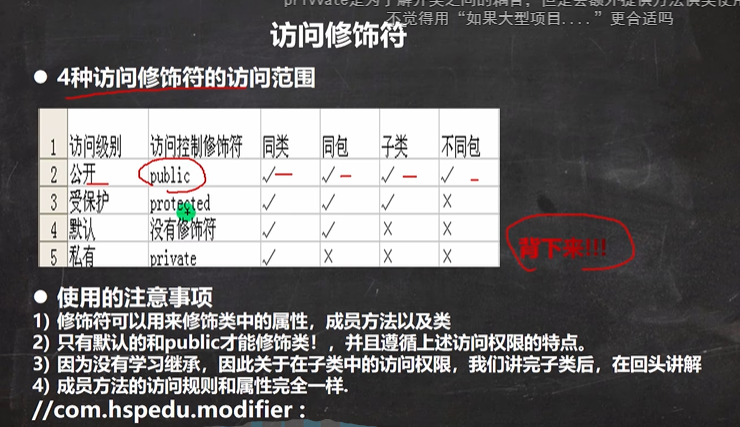
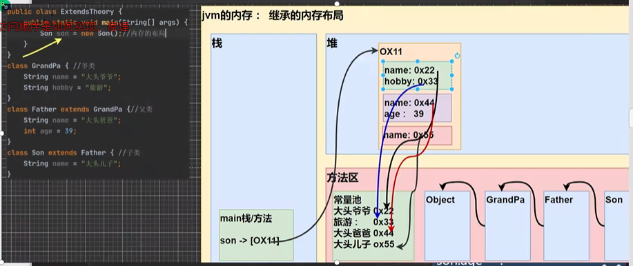

# 1、包

- 命名规则：

  只能包含数字、字母、下划线、小圆点，但不能用数字开头，不能是关键字或保留字

- 命名规范：

  一般是小写字母+小圆点

  一般是com.公司名.项目名.业务模块名

- 常用的包：

  java.lang.*	//lang包是基本包，默认引入，不需要再引入

  java.util.*	  //util包，系统提供的工具包，工具类，使用Scanner

  java.net.*	  //网络包，网络开发

  java.awt.*	  //是做java的界面开发，GUI

- 如何引入包

# 2、访问修饰符

- 基本介绍：

- java提供四种访问控制修饰符好，用于控制方法和属性(成员变量)的访问权限(范围)

  1、公开级别：用**public**修饰，对外公开

  2、受保护级别：用**protected**修饰，对子类和同一个包中的类公开

  3、默认级别：没有修饰符号，向同一个包的类公开

  4、私有级别：用**private**修饰，只有类本身可以访问，不对外公开

  

# 3、面向对象编程三大特征

- 基本介绍：面向对象编程有三大特征：封装、继承和多态

### 1、面向对象编程-封装

- 封装介绍：封装(encapsulation)就是把抽象出的数据[属性]和对数据的操作[方法]封装一起，数据被保护在内部，程序的其他部分只有通过被授权的操作[方法]，才能对数据进行操作

- 封装的理解和好处

  1、隐藏实现细节 方法(连接数据库)<--调用(传入参数...)

  2、可以对数据进行验证，保证安全合理

### 2、面向对象编程-继承

- 继承基本介绍和示意图：

  继承可以解决代码复用，让我们的编程更加靠近人类思维，当多个类存在相同的属性(变量)和方法是，可以从这些类中抽象出父类，在父类中定义这些相同的属性和方法，所有的子类不需要重新定义这些属性和方法，只需要通过extends来声明继承父类即可。

- 继承的深入讨论/细节问题：

  1、子类继承了所有的属性和方法，非私有的属性和方法可以在子类直接访问，但是私有属性不能再子类直接访问，要通过公共的方法去访问

  2、子类必须调用父类的构造器，完成父类的初始化

  3、当创建子类对象时，不管使用子类的哪个构造器，默认情况下总会去调用父类的无参构造器，如果父类没有提供无参构造器，则必须在子类的构造器中用super去指定使用父类的哪个构造器完成对父类的初始化工作，否则，编译不会通过

  4、如果希望指定去调用父类的某个构造器，则显示的调用一下：super(参数列表)

  5、super在使用时，必须放在构造器第一行

  6、super()和this()都只能放在构造器第一行，因此这两个方法不能共存在一个构造器

  7、java所有类都是Object类的子类，Object是所有类的基类

  8、父类构造器的调用不限于直接父类！将一致往上追溯知道Object类(顶级父类)

  9、子类最多只能继承一个父类(指直接继承)，即java中是单继承机制

  10、不能滥用继承，子类和父类之间必须满足is-a的逻辑关系

  

#### 1、方法重写(override)

- 注意事项和使用细节：方法重写也叫方法覆盖，需要满足下面的条件

  1、子类的方法的形参列表，方法名称，要和父类方法的形参列表，方法名称完全一样

  2、子类方法的返回类型和父类方法返回类型一样，或者是父类返回类型的子类；比如父类返回类型是Object，子类方法返回类型是String

  3、子类方法不能缩小父类方法的访问权限

### 3、面向对象编程-多态

- 多[多种]态[状态]基本介绍：

  方法或对象具有多种形态。是面向对象的第三大特征，多态是建立在封装和继承基础之上的。

- 多态的具体体现

  1、方法的多态：重写和重载就体现多态

  2、对象的多态：**需要记住**

  1. 一个对象的编译类型和运行类型可以不一致
  2. 编译类型在定义对象时，就确定了，不能改变
  3. 运行类型是可以变化的
  4. 编译类型看定义时 = 号 的左边，运行类型看 = 号的 右边

- 多态注意事项和细节讨论

  1、多态的前提时：两个对象(类)存在继承关系

  2、多态的向上转型

  1. 本质：父类的引用指向了子类的对象
  2. 语法：父类类型   引用名 = new  子类类型()；
  3. 特点：编译类型看左边，运行类型看右边。可以调用父类中的所有成员(需遵守访问权限)，不能调用子类中特有成员；最终运行效果看子类的具体实现！

  3、多态的向下转型

  1. 语法：子类类型	引用名 = new	(子类类型)	父类引用；
  2. 只能强转父类的引用，不能强转父类的对象
  3. 要求父类的引用必须指向的是当前目标类型的对象
  4. 当向下转型后，可以调用子类类型中所有的成员

  4、属性没有重写之说！属性的值看编译类型

  5、instanceOf：比较操作符，用于判断对象的运行类型是否为XX类型或XX类型的子类型

- Java的动态绑定机制（非常非常重要）

  1、当调用对象方法的时候，该方法会和该对象的内存地址/运行类型绑定

  2、当调用对象属性时，没有动态绑定机制，哪里声明，那里使用

- 多态的应用

  1、多态数组：数组的定义类型为父类类型，里面保存的实际元素类型为子类类型

  2、多态参数：方法定义的形参类型为父类类型，实参类型允许为子类类型

# 4、Object类详解

- equals方法

  ==是一个比较运算符

  1、==：既可以判断基本类型，又可以判断引用类型

  2、==：如果判断基本类型，判断的是值是否相等。

  3、==：如果判断引用类型，判断的是地址是否相等，即判定是不是同一个对象

  4、equals：是Object类中的方法，只能判断引用类型

  5、默认判断的是地址是否相等，子类中往往重写该方法，用于判断内容是否相等

- hashCode方法：返回该对象的哈希码值

  1、提高具有哈希结构的容器的效率

  2、两个引用，如果指向的是同一个对象，则哈希值肯定是一样的

  3、两个引用，如果指向的是不同对象，则哈希值是不一样的

  4、哈希值主要根据地址号来的，不能完全讲哈希值等价于地址

  5、后面在集合中，hashCode如果需要的话，也会重写

- toString方法

  - 基本介绍

    默认返回：全类名+@+哈希值的十六进制

  - 重写toString方法，打印对象或拼接对象时，都会自动调用该对象的toString形式

  - 当直接输出一个对象时，toString方法会被默认的调用

- finalize方法

  1、当对象被回收时，系统自动调用该对象的finalize方法。子类可以重写该方法，做一些释放资源的操作

  2、什么时候被回收：当某个对象没有任何引用时，则jvm就认为这个对象是一个垃圾对象，就会使用垃圾回收机制来销毁该对象，在销毁该对象前，会先调用finalize方法

  3、垃圾回收机制的调用，是由系统来决定(即有自己的GC算法)，也可以通过System.gc()主动触发垃圾回收机制

